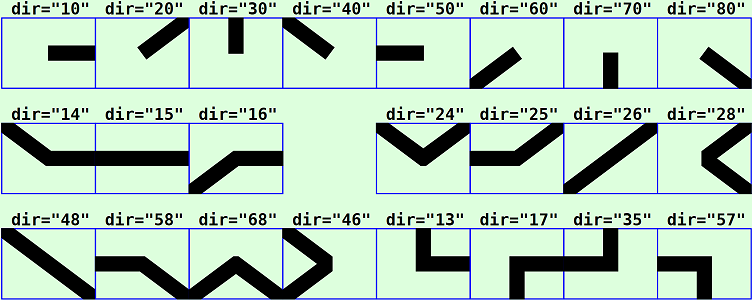
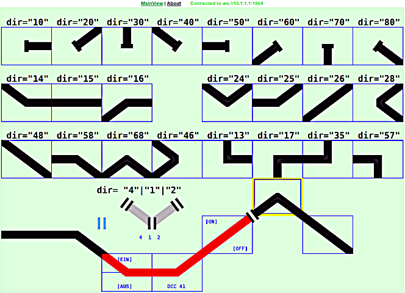
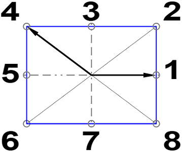
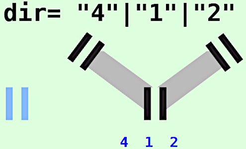
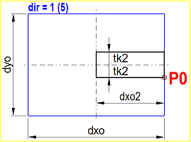
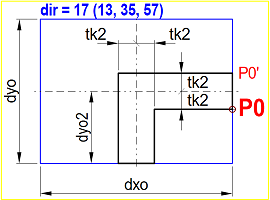
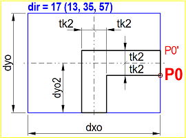
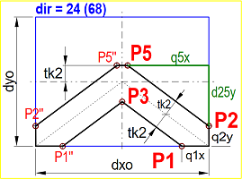
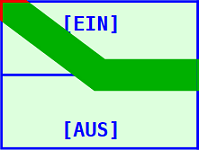
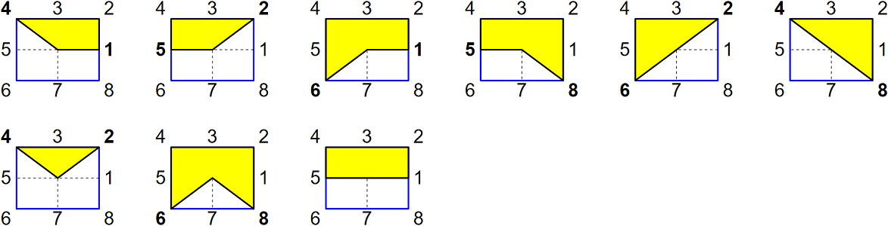

<table><tr><td></img></td><td>
Letzte &Auml;nderung: 21.1.2026 <a name="up"></a><br>   
<h1>Gleissymbole f&uuml;r RCC5V-GUIs</h1><h3>RCC5V_GUI_Demo_Track</h3>
<a href="README.md">==> English version</a>&nbsp; &nbsp; &nbsp; 
</td></tr></table>   

<a name="x10"></a>   

# 1. Einleitung
Dieses Dokument beschreibt die Verwendung von Gleissymbolen zur Erzeugung eines Gleisstellbildes f&uuml;r RCC5V-GUI-Anwendungen.   
_Bild 1_ zeigt verschiedene Symbole:   
   
_Bild 1: Gleissymbole_   

## Inhaltsverzeichnis
1. [Einleitung](#x10)   
2. [Erforderliche Hardware und Software](#x20)
3. [Anzeige und Test der Symbole](#x30)   
4. [Gliederung der Software `RCC5V_GUI_Demo_Track`](#x40)   
5. [Verwendung des `<RccTrack1>`-Tags](#x50)   
6. [Weitere Symbole](#x60)   
7. [Anmerkungen zur Programmierung](#x70)   

<a name="x20"></a>   

# 2. Erforderliche Hardware und Software
Jedes Gleissymbol besitzt die F&auml;higkeit, MQTT-Nachrichten zu senden und zu empfangen, um so den Fahrstrom ein- und auszuschalten. Um diese M&ouml;glichkeit zu testen, ist folgende __Hardware__ erforderlich:   
* Ein Gleis, dessen Stromzuf&uuml;hrung &uuml;ber einen RCC-Mikrocontroller mit einem RCC-Block ein- und ausgeschaltet werden kann.   
  _Empfehlung_: Verwendung des abschaltbaren Gleises des RCC-Blocktesters mit der DCC-Adresse 41.   
  Der Blocktester wird auf [https://github.com/khartinger/RCC5V/tree/main/examples/blocktester](https://github.com/khartinger/RCC5V/tree/main/examples/blocktester)   
  beschrieben.   
* Ein laufender MQTT-Server (zB `mosquitto`), der &uuml;ber die IP `10.1.1.1` erreichbar ist.   
* Ein PC, Laptop oder Tablet, das mit dem MQTT-Server verbunden ist (zB &uuml;ber WLAN).   

Weiters wird zum Testen aller M&ouml;glichkeiten dieses Projektes folgende __Software__ ben&ouml;tigt:   
1. Visual Studio Code   
2. die Dateien aus diesem Verzeichnis (Projekt `RCC5V_GUI_Demo_Track`)   
3. ein Browser   
4. ein installierter MQTT-Client   
  _Beispiel_: `mosquitto` mit `mosquitto_sub` und `mosquitto_pub`   
5. ein (oder zwei) Windows Eingabe-Fenster (cmd)   
6. `WinSCP` oder ein anderes FTP/SFTP-Client-Programm   

[Zum Seitenanfang](#up)   
<a name="x30"></a>   

# 3. Anzeige und Test der Symbole
Zum Anzeigen der Symbole in einem Browser-Fenster sind folgende Schritte erforderlich:   
1. Visual Studio Code (VSC) starten   
2. Projekt `RCC5V_GUI_Demo_Track` laden   
3. Im VSC-Terminalfenster `npm run serve` eingeben   
4. Browser starten und folgende Adresse eingeben:   
`http://localhost:8080/#/`   

Es werden die Gleissymbole angezeigt, allerdings haben sie noch keine Funktionalit&auml;t, weil die Verbindung zum MQTT-Server fehlt.   

Damit die Gleissymbole funktionieren (d.h. MQTT Nachrichten senden und empfangen), sind weitere Schritte notwendig:   

5. Access-Point mit MQTT-Server starten.   
   Die IP-Adresse des MQTT-Servers sollte `10.1.1.1` sein   
6. PC oder Laptop mit dem WLAN des Access-Points verbinden.   
   (zB `Raspi11`, Passwort `12345678`)   
7. Die Hardware RCC-Blocktester einschalten und kontrollieren, ob sie sich mit dem MQTT-Server verbunden hat.   

Jetzt kann man im Browser kontrollieren, ob sich einige Gleise rot (oder gr&uuml;n) gef&auml;rbt haben.

   
_Bild 2: Gleissymbole und ihre Verwendung (hier bereits mit Verbindung zur Hardware)_   

Ist auf dem PC/Laptop `mosquitto` installiert, so kann man in einem Terminal-Fenster (cmd) die MQTT-Daten&uuml;bertragung mitverfolgen. Dazu muss man zuerst ins mosquitto-Verzeichnis wechseln und den Subscriber starten:   
`cd C:/programme/mosquitto`   
`mosquitto_sub -h 10.1.1.1 -t rcc/# -v`   

Klickt man im Browser bei einem rot gef&auml;rbten Gleis in die obere H&auml;lfte des Feldes, so f&auml;rbt sich das Gleis gr&uuml;n und im RCC-Blocktester wird der Fahrstrom im Gleis eingeschaltet.   
Im Terminal-Fenster sieht man, dass folgende MQTT-Nachrichten gesendet wurden:   
```
rcc/demo1/set/41 1
rcc/demo1/ret/41 {"41":"1 received"}
rcc/demo1/ret/41 {"41":"1"}
```
Die erste Zeile ist der Schaltbefehl vom Browser, die zweite Zeile zeigt, dass der RCC-Blocktester die Nachricht erhalten hat, und die 3. Zeile zeigt, dass der Schaltvorgang erfolgreich ausgef&uuml;hrt wurde.   

Klickt man auf die untere H&auml;lfte eines Feldes, wird der Strom zum Gleis abgeschaltet und das Gleissymbol f&auml;rbt sich rot.   

[Zum Seitenanfang](#up)   
<a name="x40"></a>   

# 4. Gliederung der Software `RCC5V_GUI_Demo_Track`   
  Das VSC-Projekt liegt im Ordner `RCC5V_GUI_Demo_Track`. In diesem Verzeichnis befinden sich Dateien mit Informationen zum Projekt sowie die Unterverzeichnisse `.dist`, `images`, `node_modules` und `src`.   
Im Verzeichnis `src` befinden sich die eigentlichen Programmdateien:   
* Das Verzeichnis `classes` enth&auml;lt die Datei `Geo.ts`, in der viele Konstante und einfache Methoden definiert sind.   
* Das Verzeichnis `components` enth&auml;lt die Basis-Anzeigedatei `RccBase.vue` sowie die grafische Darstellung der Gleissymbole (`RccTrack1.vue`), der schr&auml;gen Verbindungselemente (`RccTrackCon1.vue`) und der Isolationssymbole (`RccTrackIso1.vue`).
* Das Verzeichnis `controller` enth&auml;lt einen Basis-Controller `RccBaseController.ts` sowie den Gleis-Controller `RccTrack1Controller.ts`.   
* Das Verzeichnis `router` enth&auml;lt die Datei `index.ts`, die f&uuml;r das Weiterleiten der Links in der Kopfzeile (`MainView` und `About`) verantwortlich ist.   
* Das Verzeichnis `services` enth&auml;lt die beiden Dateien `RccMqttClient.ts` und `RccMqttClientInstance.ts`. Diese enthalten alle Funktionen, die f&uuml;r die MQTT-Kommunikation ben&ouml;tigt werden.   
  Jeder Controller, der MQTT-Nachrichten empfangen will, muss in der Datei `RccMqttClientInstance.ts` registriert werden.   
* Das Verzeichnis `views` enth&auml;lt die Dateien `About.vue` und `MainView.vue`.   
  In `MainView.vue` werden die einzelnen Gleise angeordnet (mit `<RccTrack1>` Tags).   
* Die Datei `App.view` zeichnet die Gesamtansicht mit Kopfzeile und Grafik.   
* Die Datei `main.ts` startet schlie&szlig;lich die gesamte App.   

[Zum Seitenanfang](#up)   
<a name="x50"></a>   
<a name="x51"></a>   

# 5. Verwendung des `<RccTrack1>`-Tags
## 5.1 Syntax   
Gleissymbole werden in der Datei `MainView.vue` mit dem Tag `<RccTrack1 ...>` gezeichnet, wobei folgende Parameter erforderlich bzw. m&ouml;glich sind:   
* `x` (erforderlich): x-Koordinate des Mittelpunkts des Symbols in Pixel   
* `y` (erforderlich): y-Koordinate des Mittelpunkts des Symbols in Pixel   
* `dir` (erforderlich): Richtung des Gleissymbols (siehe [Kapitel 5.2](#x52))   
* `sid` (optional): ID des Symbols, mit dem Gleise gruppiert und &uuml;ber MQTT angesprochen werden.   
* `con` (optional): Verbindung eines schr&auml;gen Gleis-Endes mit dem Nachbargleis.   
   M&ouml;gliche Werte: '2', '4', '6' oder '8', je nach Richtung. Die Ziffer muss in `dir` enthalten sein.   
* `border` (optional): Gibt an, ob ein Rahmen um ein Gleissymbol gezeichnet werden soll. (M&ouml;gliche Werte 0 bis 3, Default-Wert `'0'`)   
* `label` (optional): Gibt an, ob und welche Beschriftung eines Gleissymbols angezeigt werden soll. (M&ouml;gliche Werte: "0" bis "3", Default-Wert `'0'`)   
* `color` (optional): Setzen einer Farbe f&uuml;r das Gleissymbol. (Default-Wert: "-" bedeutet Standardwert `this.geof.this.geof.colorTrack` nehmen)    
* `header` (optional): Text in der Kopfzeile   
* `headeralign` (optional): Ausrichtung der Kopfzeile ("L" f&uuml;r links, "C" f&uuml;r Mitte, "R" f&uuml;r rechte Ausrichtung, Default-Wert: `'L'`)   
* `footer` (optional): Text in der Fu&szlig;zeile   
* `footeralign` (optional): Ausrichtung der Fu&szlig;zeile ("L" f&uuml;r links, "C" f&uuml;r Mitte, "R" f&uuml;r rechte Ausrichtung, Default-Wert: `'L'`)   

<a name="x52"></a>   

## 5.2 Richtung eines Gleissymbols
Die Richtung eines Gleissymbols wird als String &uuml;ber den Parameter `dir` festgelegt und besteht aus ein oder zwei Ziffern. Je eine Ziffer gibt die Richtung eines halben Gleises an (ausgehend vom Zentrum des Symbols):   
1 ... rechts (waagrecht, x+ Achse)   
2 ... rechts oben   
3 ... oben   
4 ... links oben   
5 ... links (waagrecht, x- Achse)   
6 ... links unten   
7 ... unten   
8 ... rechts unten   
0 ... Keine Richtung   
Einstellige Werte oder ganze Zehnerwerte ergeben einen Prellbock.   

   
_Bild 3: Gleisrichtungen_   

#### _Beispiele_
15 ... gerades, waagrechtes Gleis   
25 ... Gleis, das gerade (waagrecht) von links kommt (5) und nach rechts oben (2) abbiegt.   

Im _Bild 1_ (oben) sind alle M&ouml;glichkeiten mit ihren Zahlenwerten dargestellt.   

<a name="x53"></a>   

## 5.3 MQTT-Funktionalit&auml;t
W&auml;hrend die Darstellung eines Gleissymbols in der Datei `RccTrack1.vue` festgelegt ist, wird die Funktionalit&auml;t durch die Datei `RccTrack1Controller` bestimmt.   
Die Eigenschaften einzelner Gleise werden im Array `tracks1` gespeichert. Ein Eintrag ist zB folgenderma&szlig;en aufgebaut:   
```ts
      {
        // ---test track 1--------------------------------------
        id: 'tk1',
        name: 'Track1',
        iTrack1State: -99,
        sDCC: '41',
        subTopic: 'rcc/demo1/ret/41 rcc/demo1/ret/status',
        pubTopic: 'rcc/demo1/set/41',
        payloadInvert: false,
      },
```
Bedeutung der einzelnen Parameter:   
* `id`: die ID stellt die Verbindung zum Anzeigeelement dar und muss mit dem Parameter `sid` &uuml;bereinstimmen.   
* `name`: Name des Gleises. Dieser wird derzeit nicht weiter verwendet.   
* `iTrack1State`: Status des Gleises. Ein Wert -99 bedeutet "unbestimmt", 0 bedeutet "Fahrstrom abgeschaltet" und 1 bedeutet "Fahrstrom eingeschaltet". Der Wert wird zB f&uuml;r die Anzeigefarbe des Symbols verwendet.   
* `sDCC`: DCC-Adresse des Gleises als String (zB '41').
* `subTopic`: Topics, auf die das Gleissymbol "h&ouml;rt". Dadurch kann z.B. der Schaltzustand des Gleises mit der richtigen Farbe dargestellt werden.   
   _Beispiel_: `'rcc/demo1/ret/41 rcc/demo1/ret/status'`.   
  Mehrere Topics werden durch ein Leerzeichen getrennt.   
* `pubTopic`: Topic unter dem das Gleissymbol MQTT-Nachrichten sendet.   
   _Beispiel_: `'rcc/demo1/set/41'`   
* `payloadInvert`: Damit kann der Inhalt von gesendeten und empfangenen Nachrichten umgekehrt werden. Im Normalfall bewirkt ein Klick auf die obere Schaltfl&auml;che das Senden einer "1" (bedeutet "Einschalten"). Will man stattdessen "0" senden, muss `payloadInvert=true` sein. Im Normalfall ist __`payloadInvert=false`__.

<a name="x54"></a>   

## 5.4 Vereinbarungen
### Positionsangabe
Die Angabe der Position des Mittelpunktes eines Symbols erfolgt in Pixel. Da Gleise auf einem Stellpult aneinandergereiht werden, muss man die Gr&ouml;&szlig;e der Symbole wissen. Diese ist in der Datei `classes/Geo.ts` festgelegt und wird folgenderma&szlig;en importiert:   
```ts
<script setup lang="ts">
import { Geof } from '../classes/Geo'
...
const geof = new Geof(0, 0, 1, 1)
const dx = computed(() => geof.dxo()) // x width of a symbol in pixel (80)
const dy = computed(() => geof.dyo()) // y heighth of a symbol in pixel (60)
```
Damit ergibt sich f&uuml;r die Positionierung ein Raster mit den Schrittweiten dx und dy. Die Position eines Symbols erfolgt somit &uuml;blicherweise folgenderma&szlig;en:   
`:x="1*dx"  :y="0*dy"`   
Der Punkt vor dem x bzw. y bedeutet, dass der Wert dynamisch (zu berechnen) ist.   

### sid
Die `sid` stellt die Verbindung zur Funktionalit&auml;t dar (definiert in der Datei `RccTrack1Controller.ts`). Hat ein Gleis keine Funktionalit&auml;t (d.h. der Fahrstrom kann nicht beeinflusst werden), so wird `sid="tk0"` gesetzt.

### Rahmen
Die Angabe des Rahmens ist optional. Will man allerdings den Rahmen mehrerer Symbole gleich haben und gemeinsam &auml;ndern k&ouml;nnen, so definiert man im `<script>`-Bereich eine Variable daf&uuml;r:   
`const border = 1`   
Diese Variable verwendet man dann bei der `border`-Angabe:   
`:border="border"`   

<a name="x55"></a>   

## 5.5 Beispiele
1. An der Rasterposition 0/5: Gerades, waagrechtes Gleis ohne Rahmenangabe, Beschriftung und Funktion   
```html
<RccTrack1 :x="0*dx" :y="5*dy" sid="tk0" dir="15"></RccTrack1>
```   

2. An der Rasterposition 1/5: Gleis waagrecht von links nach rechts unten. Kein Rahmen, keine Beschriftung und Funktion   
```html
<RccTrack1 :x="1*dx" :y="5*dy" sid="tk0" dir="58" :border="0"></RccTrack1>
```   

3. An der Rasterposition 2/6: Gleis von links oben nach rechts (waagrecht) mit Funktion "tk1", Standardbeschriftung und Standardrahmen   
```html
<RccTrack1 :x="2*dx" :y="6*dy" sid="tk1" dir="14" label="3" :border="border"></RccTrack1>
```   

4. An der Rasterposition 3/6: Gleis von links nach rechts oben mit Funktion "tk1" und Standardrahmen. Beschriftung: Unten Mitte "DCC 41", das Gleis-Ende rechts oben soll mitgezeichnet werden.   
```html
<RccTrack1 :x="3*dx" :y="6*dy" sid="tk1" dir="25" con="2" footer="DCC 41" footeralign="C" :border="border"></RccTrack1>
```   

5. An der Rasterposition 4/5: Gleis von links unten nach rechts oben mit Funktion "tk1" und Standardrahmen. Beschriftung: Unten Rechts "[OFF]", Oben Links "[ON]"   
```html
<RccTrack1 :x="4*dx" :y="5*dy" sid="tk1" dir="26" header="[ON]" headeralign="L" footer="[OFF]" footeralign="R" :border="border"></RccTrack1>
```   

6. An der Rasterposition 5/4: Gleis von links unten nach rechts unten, ohne Funktion und Beschriftung, mit Rahmen Nummer 3.   
```html
<RccTrack1 :x="5*dx" :y="4*dy" sid="tk0" dir="68" :border="3"></RccTrack1>
```   

7. An der Rasterposition 6/5: Gleis von links oben nach rechts unten ohne Funktion und Beschriftung, mit Standardrahmen.   
```html
<RccTrack1 :x="6*dx" :y="5*dy" sid="tk0" dir="48" :border="border"></RccTrack1>
```   

[Zum Seitenanfang](#up)   
<a name="x60"></a>   
<a name="x61"></a>   

# 6. Weitere Symbole
## 6.1 Gleistrennsymbol
Das Gleistrennsymbol besteht aus zwei parallelen Strichen und kennzeichnet Trennstellen bei der Fahrstromversorgung. Die Verwendung ist optional und hat keine Wirkung auf die Funktion des grafischen Gleisplans.   

Folgende Parameter sind m&ouml;glich:   
* `x` (erforderlich): x-Koordinate des Zentrums des Symbols in Pixel   
* `y` (erforderlich): y-Koordinate des Zentrums des Symbols in Pixel   
* `dir` (erforderlich): Richtung des Symbols (Werte "1", "2" oder "4". Siehe unten)   
* `sid` (optional): ID des Symbols. Diese hat keine besondere Bedeutung.   
* `color` (optional): Setzen einer Farbe f&uuml;r das Gleissymbol (Keine Farbe "-")    

F&uuml;r die Richtung des Symbols (`dir`) gibt es drei M&ouml;glichkeiten, wie das folgende Bild zeigt:   

   
_Bild 4: Isoliersymbole_   

Zus&auml;tzlich sieht man im Bild links unten ein gef&auml;rbtes Isoliersymbol.   
F&uuml;r senkrechte Gleise gibt es kein Isoliersymbol.   
Die Isoliersymbole werden &uuml;blicherweise nach den Gleissymbolen gezeichnet.   

### Beispiel
Isoliersymbol an der Stelle 4,5/4,5 in Richtung links oben.   
```html
<RccTrackIso1 :x="4.5*dx" :y="4.5*dy" sid="iso1" dir="2"></RccTrackIso1>
```   

<a name="x62"></a>   

## 6.2 Schr&auml;ge Verbindungselemente
Schr&auml;ge Gleissymbole enden in der Ecke an den waagrechten und senkrechten Symbolgrenzen. Bei der Aneinanderreihung kommt es an den Ecken zu Fehlstellen, die durch Elemente des Typs `RccTrackCon1` ausgeglichen werden k&ouml;nnen.   
Es gibt zwei Arten f&uuml;r die beiden schr&auml;gen Richtungen "2" und "4".   
Soll das Verbindungselement seine Farbe __gemeinsam__ mit dem Gleis mit &auml;ndern, so muss man die Option "`con`" des `RccTrack1`-Tags verwenden!   

F&uuml;r die Parameter gilt das gleiche wie f&uuml;r `RccTrack1Iso`:   
* `x` (erforderlich): x-Koordinate des Zentrums des Symbols in Pixel   
* `y` (erforderlich): y-Koordinate des Zentrums des Symbols in Pixel   
* `dir` (erforderlich): Richtung des Symbols (Werte "2" oder "4").   
* `sid` (optional): ID des Symbols. Diese hat keine besondere Bedeutung.   
* `color` (optional): Setzen einer Farbe f&uuml;r das Gleissymbol (Keine Farbe "-").   

### Beispiele
1. Verbindungselement an der Position 1,5/5,5 in Richtung rechts unten (4) mit der Farbe `geof.colorTrackOff`.   
```html
<RccTrackCon1 :x="1.5*dx" :y="5.5*dy" sid="con0" dir="4" :color="geof.colorTrackOff"></RccTrackCon1>
```   
Hier ist die Farbe des Verbindungselements fest vorgegeben (rot). &Auml;ndert sich der Fahrstrom-Zustand des Gleises auf "ein", werden die Gleise gr&uuml;n gef&auml;rbt, aber das Verbindungselement bleibt rot.   

2. Verbindungselement an der Position 5,5/4,5 in Richtung rechts unten (4).   
```html
<RccTrackCon1 :x="5.5*dx" :y="4.5*dy" sid="con0" dir="4"></RccTrackCon1>
```   

[Zum Seitenanfang](#up)   
<a name="x70"></a>   
<a name="x71"></a>   

# 7. Anmerkungen zur Programmierung   
## 7.1 Zeichnen der Gleissymbole
Gleissymbole bestehen aus bis zu drei Teilen:   
* das Gleissymbol selbst   
* eventuell eine zus&auml;tzliche Verl&auml;ngerung eines schr&auml;gen Gleises   
* eventuell ein Prellbock   

### 7.1.1 Gleissymbol
Die Art des Gleissymbols wird durch die Angabe der Richtung (Parameter `dir`) festgelegt (siehe [Kapitel 5.2](#x52)). Das Zeichnen des Symbols erfolgt so:   

Im `<template>` steht die Anweisung   
```html
<path :d="pathTrack" :fill="colorTrack" :stroke="colorTrack" stroke-width="1" />
```   
Darin ist `pathTrack` der Pfad (die Geometrie) der Zeichnung und `colorTrack` die Farbe des Symbols.   

Im `<script>` Bereich wird in der Funktion `pathTrack` der Pfad zusammengestellt. Mit Hilfe der Funktion `dirNum` wird zuerst der eingegebene `dir=`-Parameter in eine Zahl `dir1` umgewandelt, bei der die Zehnerziffer immer kleiner als die Einerziffer ist.   
Viele Symbole sind spiegelbildlich, daher wird ein Grundsymbol gezeichnet und dieses bei Bedarf gespiegelt. Das Spiegeln wird durch die Variablen `sgnx` und `sgny` bewirkt (Wert 1 = ungespiegelt, -1 = spiegeln).   
Folgende Symbole werden mit Zeichenbefehlen (wie `M`, `m`, `h`, `v`, `l`) gezeichnet:   
 
 
 
 
 
 
 
   
_Bild 4: Basissymbole f&uuml;r Gleise_   

Die Koordinaten der Punkte P0 bis P6 werden im Ordner `classes` in der Datei `Geo.ts` berechnet, wobei die positive y-Achse nach __unten__ gerichtet ist.   
#### Gegebene Gr&ouml;&szlig;en   
* `tk2 ....` Halbe Gleisbreite   
* `txo2 ...` Halbe Breite des Symbolfeldes   
* `tyo2 ...` Halbe H&ouml;he des Symbolfeldes   

#### Hilfsgr&ouml;&szlig;en   
$\ \text{Steigung} ~ k = \displaystyle{{dyo2} \over {dxo2}} $   

$\ \text{Wurzel} ~ w = \sqrt {1 + k^2 ~} $   

#### Koordinaten   
$\ \Large P_0 \left( \displaystyle ~ dxo2 ~ \Big/ ~ tk2 ~ \right) $   

$\ \Large P_1 \left( \displaystyle \frac{1}{k} \cdot \Big[ dyo2 - tk2 \cdot \sqrt{1+k^2} \Big] ~ \Big/ ~ dyo2 \right) $

$\ \Large P_2 \left( \displaystyle dxo2 ~ \Big/ ~ k \cdot dxo2 - tk2 \cdot \sqrt{1+k^2} \right) $

$\ \Large P_3 \left( \displaystyle 0 ~ \Big/ ~ tk2 \cdot \sqrt{1+k^2} \right) $

$\ \Large P_4 \left( \displaystyle \frac{k \cdot tk2}{\sqrt{1+k^2}} ~ \Big/ ~ \frac{-tk2}{\sqrt{1+k^2}} \right) $

$\ \Large P_5 \left( \displaystyle \frac{tk2}{k} \cdot \Big[\sqrt{1+k^2} ~ - ~ 1 \Big] ~ \Big/ ~ -tk2 \right) $

$\ \Large P_6 \left( \displaystyle \frac{tk2}{k} \cdot \sqrt{1+k^2} ~ \Big/ ~ 0 \right) $


### 7.1.2 Zus&auml;tzliche Verl&auml;ngerung
Die Verl&auml;ngerung eines schr&auml;gen Gleises dient zur Verbindung mit dem Nachbargleis und wird durch die Verwendung des Parameters `con` bewirkt.   
Im `<template>` steht die Anweisung   
```html
<RccTrackCon1 v-if="conB" :x="conX" :y="conY" sid="con0" :dir="con" :color="colorTrack"></RccTrackCon1>
```   

Das bedeutet, zum Zeichnen wird ein Objekt `RccTrackCon1` verwendet, dass in der Datei `RccTrackCon1.vue` definiert wird. Damit man es verwenden kann, muss es im `<script>`-Bereich eingebunden werden:   
```ts
import RccTrackCon1 from './RccTrackCon1.vue'

export default defineComponent({
  name: 'RccTrack1',
  components: {
    RccBase,
    RccTrackCon1,
  },
```   

Die Farbe des Symbols (`colorTrack`) und die &uuml;brigen Parameter werden im Bereich `computed: {` erzeugt:   
```ts
    // _______color of the track________________________________
    colorTrack: function (): string {
      if (this.color.length > 2) return this.color
      if (this.iTrack1State === 0) return this.geof.colorTrackOff
      if (this.iTrack1State === 1) return this.geof.colorTrackOn
      if (this.iTrack1State === 2) return this.geof.colorTrackUsed
      if (this.iTrack1State === -99) return this.geof.colorTrackUnknown
      return this.geof.colorTrack
    },
```   
bzw.   
```ts   
    // =======connector specific functions======================
    // _______draw a connector?_________________________________
    conB: function (): boolean {
      if (this.con.length > 0) {
        if (this.dir.includes(this.con)) return true
      }
      return false
    },
    // _______x-position of connector___________________________
    conX: function (): number {
      if (this.con === '2' || this.con === '8') return this.x + this.geof.dxo2()
      if (this.con === '4' || this.con === '6') return this.x - this.geof.dxo2()
      return this.x
    },
    // _______y-position of connector___________________________
    conY: function (): number {
      if (this.con === '2' || this.con === '4') return this.y - this.geof.dyo2()
      if (this.con === '6' || this.con === '8') return this.y + this.geof.dyo2()
      return this.y
    },
```   

### 7.1.3 Prellbock (buffer stop)
Gleise, die in der Mitte des Symbols enden (Pfad Nummer 1 bis 8 bzw. 10 bis 80), erhalten ein Rechteck als "Prellbock". Dieses wird im `<template>` durch   
```html
<path :d="drawBufferStop" :fill="colorTrack" :stroke="colorTrack" stroke-width="1" />
```   
gezeichnet, wobei der Pfad in der Funktion `drawBufferStop` zusammengestellt wird (im `<script`-Bereich `computed`).   
```ts   
    // _______draw a buffer stop ("end of track")_______________
    // size of the rectangle: length = 3*tk2, width = tk2 (=tk/2)
    drawBufferStop: function (): string {
      const dir1 = this.dirNum
      if (dir1 < 1 || dir1 > 8) return ''
      const tk2 = this.geof.tk2
      const dxo2 = this.geof.dxo2()
      const dyo2 = this.geof.dyo2()
      const tks = tk2 / 2
      const w = Math.sqrt(dxo2 * dxo2 + dyo2 * dyo2)
      const tks4 = dxo2 * tks / w
      const tks3 = dyo2 * tks / w
      let sgnx = 1
      let s1 = ''
      switch (dir1) {
        case 1: case 5: // --vertical rectangle | --------------
          s1 += ' M' + this.x + ',' + this.y
          s1 += ' m' + (-tks) + ',' + (-3 * tks)
          s1 += ' v' + (6 * tks)
          s1 += ' h' + (2 * tks)
          s1 += ' v' + (-6 * tks)
          s1 += ' z'
          break
        case 3: case 7: // --horizontal rectangle - ------------
          s1 += ' M' + this.x + ',' + this.y
          s1 += ' m' + (-3 * tks) + ',' + (-tks)
          s1 += ' v' + (2 * tks)
          s1 += ' h' + (6 * tks)
          s1 += ' v' + (-2 * tks)
          s1 += ' z'
          break
        case 2: case 6: // --diagonal rectangle \ --------------
          sgnx = -1
          /* falls through */
        case 4: case 8: // --diagonal rectangle / --------------
          s1 += ' M' + this.x + ',' + this.y
          s1 += ' m' + sgnx * (3 * tks3 + tks4) + ',' + (-3 * tks4 + tks3)
          s1 += ' l' + sgnx * (-6 * tks3) + ',' + (6 * tks4)
          s1 += ' l' + sgnx * (-2 * tks4) + ',' + (-2 * tks3)
          s1 += ' l' + sgnx * (6 * tks3) + ',' + (-6 * tks4)
          s1 += ' z'
          break
        default:
      }
      return s1
    },
```   

<a name="x72"></a>   

## 7.2 Klickbereiche f&uuml;r Gleissymbole
Zu Beginn der Entwicklung wurden die beiden rechteckigen Klickbereiche "Ein" = obere H&auml;lfte des Symbol-Rechtecks und "Aus" = untere H&auml;lfte definiert:   
   
_Bild 5: Rechteckige Klickbereiche_   
In der Praxis zeigte sich, dass es besser ist, wenn die Klickbereiche an den Gleisverlauf angepasst sind. Daher werden die rechteckigen Klickbereiche durch Pfade ersetzt (Funktionen `pathTop` und `pathBottom`).   

Insgesamt werden f&uuml;r den oberen Bereich neun Klickfl&auml;chen f&uuml;r folgende Gleisrichtungen definiert:   
14, 4 und 46 | 25, 2 und 28 | 16 und 6 | 58 und 8 | 26 | 48 | 24 | 68   

   
_Bild 6: Alle Klickbereiche Top_   

Wenn kein spezieller Klickbereich zugeordnet ist, werden - so wie bisher - die Rechtecke verwendet.   
Die unteren Klickfl&auml;chen ergeben sich aus dem "Rest" des Symbolrechtecks.   

<a name="x73"></a>   

## 7.3 Senden der MQTT-Nachrichten
Beim Schalten des Fahrstroms gilt normalerweise, dass 1 Einschalten und 0 Ausschalten bewirkt. Daher wird im Normalfall beim Klicken der oberen Schaltfl&auml;che ("Top") eine 1 und beim Klicken der unteren Schaltfl&auml;che ("Bottom") eine 0 gesendet. Manchmal kann es jedoch erforderlich sein, dass die Bedeutung von 0 und 1 genau umgekehrt ist. Diese Besonderheit wird in der Software folgenderma&szlig;en ber&uuml;cksichtigt.   

Das Senden von Nachrichten passiert in der `Klasse RccTrack1Controller`. Dort werden zwei Variablen `payloadTrackOn` und `payloadTrackOff` definiert, die den "Normalzustand" abbilden.   
```
export class RccTrack1Controller extends RccBaseController {
  public payloadTrackOn = '1'
  public payloadTrackOff = '0'
```

Beim Klicken in die obere Schaltfl&auml;che des Symbols wird die Funktion `onClkTop` aufgerufen. In dieser wird die Payload entsprechend dem Wert von `payloadInvert` angepasst und es werden die Nachricht(en) gesendet:   
```ts
    // _______on click: turn track energy on____________________
    onClkTop: function (): void {
      console.log(this.sid, 'Button-Click On')
      // -----is there a topic for publishing?------------------
      if (this.track1?.pubTopic) {
        const aPubTopic = this.track1.pubTopic.split(' ')
        // ---prepare payload (1 or 0)--------------------------
        let trackon1 = rccTrack1Controller.payloadTrackOn
        if (this.track1.payloadInvert) trackon1 = rccTrack1Controller.payloadTrackOff
        const payload = trackon1
        // ---publish message(s)--------------------------------
        aPubTopic.forEach(topic => {
          if (this.track1?.pubTopic) {
            rccTrack1Controller.publishRcc(topic, payload)
          }
        })
      }
    },
```

Das Senden erfolgt mit der Funktion `publishRcc`, die in der Datei `RccTrack1Controller.ts` steht:   
```ts
  // _________publish a mqtt message____________________________
  public publishRcc (topic: string, payload: string): void {
    // console.log('RccTrack1Controller:publishRcc:', '-t ' + topic + ' -m ' + payload)
    this.publish(topic, payload, false, 0).catch((e) => { console.error('RccTrack1Controller: ERROR:', e) })
  }
```

F&uuml;r die untere Schaltfl&auml;che wird das gleiche in der Funktion `onClkBottom` gemacht.   

<a name="x74"></a>   

## 7.4 Empfang von MQTT-Nachrichten
Der Empfang von MQTT-Nachrichten erfolgt in der Datei `RccTrack1Controller.vue` in der Funktion `onMessage`. Dort wird die Statusnummer - abh&auml;ngig vom empfangenen Wert und dem Wert von `payloadInvert` - festgelegt und in `iTrack1State` gespeichert.   
```ts
  // _________receive messages__________________________________
  public onMessage (message: Message): void {
    this.tracks1.forEach(track1 => {
      const aSubTopic = track1.subTopic.split(' ')
      if (aSubTopic.includes(message.topic)) {
      // -----track1 topic found -----------------------------
        if (message.payload.length > 0) {
          // ------message received: split JSON-data----------
          try {
            const aPayload = JSON.parse(message.payload)
            const sDCC_ = track1.sDCC
            const sState_ = aPayload[sDCC_]
            // ----calculate the status number------------------
            if (sState_ === this.sState0) {
              track1.iTrack1State = 0
              if (track1.payloadInvert) track1.iTrack1State = 1
            }
            if (sState_ === this.sState1) {
              track1.iTrack1State = 1
              if (track1.payloadInvert) track1.iTrack1State = 0
            }
            // console.log('onMessage: sState=', sState)
          } catch (error) {
            track1.iTrack1State = -99
          }
        }
        // console.log('onMessage: track1.iTrack1State=', track1.iTrack1State)
        // ---END: track1 topic found --------------------------
      }
    })
  }
```


<a name="x75"></a>   

## 7.5 Gleichzeitiges Schalten aller Gleise durch MQTT-Nachrichten
Manchmal ist es von Vorteil, dass man den Fahrstrom aller schaltbaren Gleise gemeinsam ein- oder ausschalten kann. Da in `RccTrack1Controller.ts` im Array `tracks1` die Daten aller schaltbaren Gleise gespeichert sind, werden dort die Funktionen `sendAllTracksOn` und `sendAllTracksOff` zum Schalten aller Gleise definiert. Das Schalten erfolgt dadurch, dass an alle Gleise eine Nachricht mit dem unter `pubTopic` angegebenen Topic gesendet wird. Die Payload wird entsprechend dem Wert von `payloadInvert` angepasst.   
Damit nicht alle Gleise gleichzeitig schalten, ist eine Verzögerung von `WAIT_BETWEEN_MQTT_MSG_MS` Millisekunden (50 ms) zwischen zwei Sendevorgängen eingebaut.   

```ts   
  // ____publish message: "All tracks on"_______________________
  public async sendAllTracksOn (): Promise<void> {
    for (const track of this.tracks1) {
      try {
        // ---prepare payload-----------------------------------
        let payload = this.payloadTrackOn
        if (track.payloadInvert) payload = this.payloadTrackOff
        // ---send message--------------------------------------
        await this.publish(track.pubTopic, payload, false, 0)
        await sleep(WAIT_BETWEEN_MQTT_MSG_MS) // 0,1s delay
      } catch (e) {
        console.error('RccTrack1Controller:', e)
      }
    }
  }

  // ____publish message: "All tracks off"______________________
  public async sendAllTracksOff (): Promise<void> {
    for (const track of this.tracks1) {
      try {
        // ---prepare payload-----------------------------------
        let payload = this.payloadTrackOff
        if (track.payloadInvert) payload = this.payloadTrackOn
        // ---send message--------------------------------------
        await this.publish(track.pubTopic, payload, false, 0)
        await sleep(WAIT_BETWEEN_MQTT_MSG_MS) // 0,1s delay
      } catch (e) {
        console.error('RccTrack1Controller:', e)
      }
    }
  }
} // END OF export class RccTrack1Controller

// ______sleep given milliseconds_______________________________
function sleep (ms: number): Promise<void> {
  return new Promise(resolve => setTimeout(resolve, ms))
}
```   

[Zum Seitenanfang](#up)