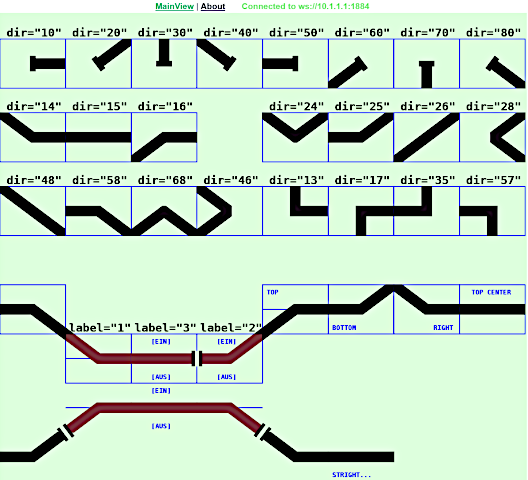

<table><tr><td></img></td><td>
Letzte &Auml;nderung: 2.1.2026 <a name="up"></a><br>   
<h1>RCC5V_GUI_Demo_Track: Gleissymbole für die RCC5V-GUI</h1>
<a href="README.md">==> English version</a>&nbsp; &nbsp; &nbsp; 
</td></tr></table>   

<a name="x10"></a>   

# 1. Einleitung
Diese VUE-Anwendung zeigt, welche Symbole es zum Zeichnen von Gleisen gibt und wie diese angewendet werden. Die Anleitung besteht aus folgenden Teilen:   
1. [Einleitung](#x10)   
2. [Anzeige und Test der Symbole](#x20)   
3. [Gliederung der Software `RCC5V_GUI_Demo_Track`](#x30)   

Da die Symbole auch das Ein- und Ausschalten der Gleisstromversorgung ermöglichen, ist folgende Hardware erforderlich:   
* Ein Gleis, dessen Stromzuführung abgeschaltet werden kann.   
  Beispiel: Verwendung des abschaltbaren Gleises (DCC-Adresse 41) des RCC-Blocktesters, der auf [https://github.com/khartinger/RCC5V/tree/main/examples/blocktester](https://github.com/khartinger/RCC5V/tree/main/examples/blocktester) beschrieben wird   
* Ein laufender MQTT-Server (zB `mosquitto`), der über die IP `10.1.1.1` erreichbar ist   
* Ein PC, Laptop oder Tablet, das mit dem MQTT-Server verbunden ist (zB über WLAN)   

Als Software wird   
* Visual Studio Code   
* ein Browser   
* ein Terminal-Fenster   

benötigt.   

Das folgende Bild zeigt die verfügbaren Gleissymbole:   

   
_Bild 1: Gleissymbole_   

[Zum Seitenanfang](#up)   
<a name="x20"></a>   

# 2. Anzeige und Test der Symbole
Zum Anzeigen der Symbole sind folgende Schritte erforderlich:   
1. Visual Studio Code (VSC) starten   
2. Projekt `RCC5V_GUI_Demo_Track` laden   
3. Im VSC-Terminalfenster `npm run serve` eingeben   
4. Browser starten und folgende Adresse eingeben:   
`http://localhost:8080/#/`   

Es werden die Gleissymbole angezeigt, 
allerdings haben sie keine Funktionalität, weil die Verbindung zum MQTT-Server noch fehlt.   
   
_Bild 2: Gleissymbole und ihre Verwendung_   

Um die Funktionalität der Gleissymbole zu demonstrieren, sind folgende weitere Schritte notwendig:
5. Access-Point mit MQTT-Server starten   
   (IP-Adresse des MQTT-Servers sollte `10.1.1.1` sein)   
6. PC oder Laptop mit dem WLAN des Access-Points verbinden (zB `Raspi11`, Passwort `12345678`)   
7. Die Hardware RCC-Blocktester einschalten und kontrollieren, ob sie sich mit dem MQTT-Server verbunden hat.   

Jetzt kann man im Browser kontrollieren, ob 
sich einige Gleise rot (oder grün) gefärbt 
haben.

Ist auf dem PC/Laptop `mosquitto` installiert, so kann man in einem Terminal-Fenster (cmd) die MQTT-Datenübertragung mitverfolgen. Dazu muss man zuerst ins mosquitto-Verzeichnis wechseln und den Subscriber starten:   
`cd C:/programme/mosquitto`   
`mosquitto_sub -h 10.1.1.1 -t rcc/# -v`   

Klickt man im Browser bei einem rot gefärbten Gleis in die obere Hälfte des Feldes, so färbt sich das Gleis grün und im RCC-Blocktester wird der Strom im Gleis eingeschaltet.   
Im Terminal-Fenster sieht man, dass folgende MQTT-Nachrichten gesendet wurden:   
```
rcc/demo1/set/41 1
rcc/demo1/ret/41 {"41":"1 received"}
rcc/demo1/ret/41 {"41":"1"}
```
Die erste Zeile ist der Schaltbefehl vom Browser, die zweite Zeile zeigt, dass der RCC-Blocktester die Nachricht erhalten hat und die 3. Zeile zeigt, dass der Schaltvorgang erfolgreich ausgeführt wurde.   

Klickt man auf die untere Hälfte eines Feldes, wird der Strom zum Gleis abgeschaltet und das Gleissymbol färbt sich rot.   

[Zum Seitenanfang](#up)   
<a name="x30"></a>   

# 3. Gliederung der Software `RCC5V_GUI_Demo_Track`   
  Das VSC-Projekt liegt im Ordner `RCC5V_GUI_Demo_Track`. In diesem Verzeichnis befinden sich Dateien mit Informationen zum Projekt sowie die Unterverzeichnisse `.dist`, `images`, `node_modules` und `src`.   
Im Verzeichnis `src` befinden sich die eigentlichen Programmdateien:   
* Das Verzeichnis `classes` enthält die Datei `Geo.ts`, in der viele Konstante und einfache Methoden definert sind.   
* Das Verzeichnis `components` enthält die grafische Darstellung der Gleissymbole (`RccTrack1.vue`), von schrägen Verbindungselementen (`RccTrackCon1.vue`) und Isolationssymbolen (`RccTrackIso1.vue`) sowie die Basis-Anzeigedatei `CiBase.vue`.´
* Das Verzeichnis `controller` enthält einen Basis-Controller `CiBaseController.ts` sowie den Gleiscontroller `RccTrack1Controller.ts`.   
* Das Verzeichnis `router` enthält die Datei `index.ts`, die für das Weiterleiten der Links in der ersten Zeile (Kopfzeile mit `MainView` und `About`) verantwortlich ist.   
* Das Verzeichnis `services` enthält die beiden Dateien `CiMqttClient.ts` und `CiMqttClientInstance.ts`. Diese enthalten alle Funktionen, die für die MQTT-Kommunikation benötigt werden.   
  Jeder Controller, der MQTT-Nachrichten empfangen will, muss in `CiMqttClientInstance.ts` registriert werden.   
* Das Verzeichnis `views` enthält die Dateien `About.vue` und `MainView.vue`.   
  In `MainView.vue` werden die einzelnen Gleise angeordnet (mit <RccTrack1 ..> Tags).   
* Die Datei `App.view` zeichnet die Gesamtansicht mit Kopfzeile und Grafik.   
* Die Datei `main.ts` startet schließlich die gesamte App.   

# ..ToDo..

# 4. Aufruf eines Symbols


## Syntax   
Gleissymbole werden mit dem Tag `<RccTrack ...>` aufgerufen, wobei folgende Parameter erforderlich bzw. möglich sind:   
* `x` (erforderlich): x-Koordinate des Zentrums des Symbols   
* `y` (erforderlich): y-Koordinate des Zentrums des Symbols   
* `dir` (erforderlich): Art (und damit Richtung) des Gleissymbols   
* `sid` (optional): ID des Symbols, mit dem Gleise gruppiert und über MQTT angesprochen werden.   
* `border` (optional): Gibt an, ob ein Rahmen um ein Gleissymbol gezeichnet werden soll   
* `label` (optional): Gibt an, ob und welche Beschriftung eines Gleissymbols angezeigt werden soll   
* `color` (optional): Setzen einer Farbe für das Gleissymbol    

## Beispiele

# ...ToDo...

# Weitere Symbole
## Gleistrennsymbol

## Schräge Verbindungselemente


[Zum Seitenanfang](#up)