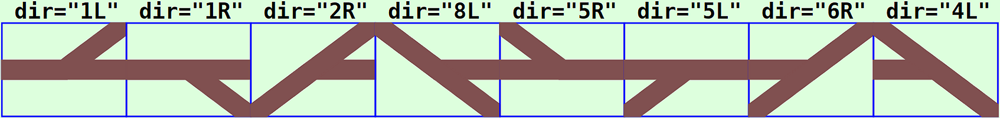
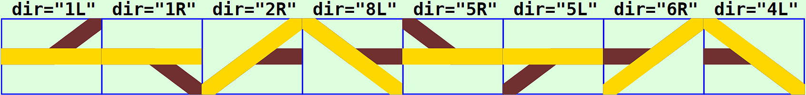
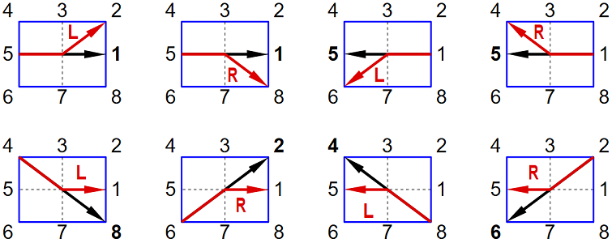
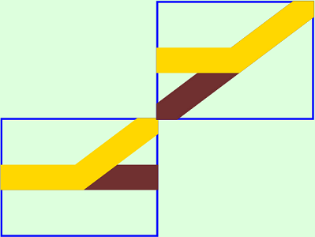

<table><tr><td></img></td><td>
Letzte &Auml;nderung: 21.1.2026 <a name="up"></a><br>   
<h1>Weichensymbole  f&uuml;r RCC5V-GUIs</h1><h3>RCC5V_GUI_Demo_Turnout</h3>
<a href="README.md">==> English version</a>&nbsp; &nbsp; &nbsp; 
</td></tr></table>   

# 1. Einleitung
Dieses Dokument beschreibt die Verwendung von (Zweiweg-)Weichensymbolen zur Erzeugung eines Gleisstellbildes f&uuml;r RCC5V-GUI-Anwendungen.   
_Bild 1_ zeigt verschiedene Weichensymbole mit ihrer Bezeichnung . Die Symbole habe keine Verbindung zu einer realen Weiche, daher ist keine Schaltstellung eingezeichnet.   
   
_Bild 1: Weichensymbole_   

## Inhaltsverzeichnis
1. [Einleitung](#x10)   
2. [Erforderliche Hardware und Software](#x20)
3. [Anzeige und Test der Symbole](#x30)   
4. [Gliederung der Software `RCC5V_GUI_Demo_Turnout`](#x40)   
5. [Verwendung des `<RccTurnout1>`-Tags](#x50)   
6. [Anmerkungen zur Programmierung](#x60)   

<a name="x20"></a>   

# 2. Erforderliche Hardware und Software
Zum Steuern der Weiche ist folgende Hardware erforderlich:   
* (Mindestens) eine Weiche mit Ansteuerung &uuml;ber einen RCC-Mikrocontroller und RCC-Block   
  _Empfehlung_: Verwendung der Weiche im RCC-Blocktester, der auf [https://github.com/khartinger/RCC5V/tree/main/examples/blocktester](https://github.com/khartinger/RCC5V/tree/main/examples/blocktester) beschrieben wird (DCC-Adresse 21).   
* Ein laufender MQTT-Server (zB `mosquitto`), der &uuml;ber die IP `10.1.1.1` erreichbar ist.   
* Ein PC, Laptop oder Tablet, das mit dem MQTT-Server verbunden ist (zB &uuml;ber WLAN).   

Weiters wird zum Testen aller M&ouml;glichkeiten dieses Projektes folgende __Software__ ben&ouml;tigt:   
1. Visual Studio Code   
2. die Dateien aus diesem Verzeichnis (Projekt `RCC5V_GUI_Demo_Turnout`)   
3. ein Browser   
4. ein installierter MQTT-Client   
  _Beispiel_: `mosquitto` mit `mosquitto_sub` und `mosquitto_pub`   
5. ein (oder zwei) Windows Eingabe-Fenster (cmd)   
6. `WinSCP` oder ein anderes FTP/SFTP-Client-Programm   

[Zum Seitenanfang](#up)   
<a name="x30"></a>   

# 3. Anzeige und Test der Symbole
Zum Anzeigen der Symbole in einem Browser-Fenster sind folgende Schritte erforderlich:   
1. Visual Studio Code (VSC) starten   
2. Projekt `RCC5V_GUI_Demo_Turnout` laden   
3. Im VSC-Terminalfenster `npm run serve` eingeben   
4. Browser starten und folgende Adresse eingeben:   
`http://localhost:8080/#/`   

Es werden die Weichensymbole angezeigt, allerdings haben sie noch keine Funktionalit&auml;t, weil die Verbindung zum MQTT-Server fehlt.   

Damit die Weichensymbole funktionieren (d.h. MQTT Nachrichten senden und empfangen), sind weitere Schritte notwendig:   

5. Access-Point mit MQTT-Server starten.   
   Die IP-Adresse des MQTT-Servers sollte `10.1.1.1` sein   
6. PC oder Laptop mit dem WLAN des Access-Points verbinden.   
   (zB `Raspi11`, Passwort `12345678`)   
7. Die Hardware RCC-Blocktester einschalten und kontrollieren, ob sie sich mit dem MQTT-Server verbunden hat.   

Jetzt kann man im Browser kontrollieren, ob die Weichenstellung angezeigt wird.

_Bild 2_ zeigt die Weichen in Weichenstellung "Gerade".   
   
_Bild 2: Weichensymbole in Weichenstellung "Gerade"_   

Ist auf dem PC/Laptop `mosquitto` installiert, so kann man in einem Terminal-Fenster (cmd) die MQTT-Daten&uuml;bertragung mitverfolgen. Dazu muss man zuerst ins mosquitto-Verzeichnis wechseln und den Subscriber starten:   
`cd C:/programme/mosquitto`   
`mosquitto_sub -h 10.1.1.1 -t rcc/# -v`   

Klickt man im Browser bei der Weiche "1L" ins obere Feld, wird die Weiche im RCC-Blocktester auf "Abzweig" gestellt und alle Weichensymbole wechseln auf Anzeige "Abzweig" (weil in diesem Beispiel alle Weichen die gleiche Weichen-sid `sid="to1"` haben).   
Im Terminal-Fenster sieht man, dass folgende MQTT-Nachrichten gesendet wurden:   
```
rcc/demo1/set/21 0
rcc/demo1/ret/21 {"21":"0 received"}
rcc/demo1/ret/21 {"21":"-1"}
rcc/demo1/ret/21 {"21":"0"}
```
Die erste Zeile ist der Schaltbefehl vom Browser und die zweite Zeile zeigt, dass der RCC-Blocktester die Nachricht erhalten hat. Die 3. Zeile ergibt sich aus dem undefinierten Zwischenzustand w&auml;hrend des Schaltens der Weiche (Wert `-1`) und die vierte Zeile zeigt, dass der Schaltvorgang erfolgreich ausgef&uuml;hrt wurde (`0` steht im Normalfall f&uuml;r Abzweig).   

Klickt man auf die untere H&auml;lfte des Feldes, wird Die Weiche auf Gerade geschaltet.   

[Zum Seitenanfang](#up)   
<a name="x40"></a>   

# 4. Gliederung der Software `RCC5V_GUI_Demo_Turnout`   
  Das VSC-Projekt liegt im Ordner `RCC5V_GUI_Demo_Turnout`. In diesem Verzeichnis befinden sich Dateien mit Informationen zum Projekt sowie die Unterverzeichnisse `.dist`, `images`, `node_modules` und `src`.   
Im Verzeichnis `src` befinden sich die eigentlichen Programmdateien:   
* Das Verzeichnis `classes` enth&auml;lt die Datei `Geo.ts`, in der viele Konstante und einfache Methoden definiert sind.   
* Das Verzeichnis `components` enth&auml;lt die Basis-Anzeigedatei `RccBase.vue` sowie die grafische Darstellung der Weichensymbole (`RccTurnout1.vue`).
* Das Verzeichnis `controller` enth&auml;lt einen Basis-Controller `RccBaseController.ts` sowie den Weichen-Controller `RccTurnout1Controller.ts`.   
* Das Verzeichnis `router` enth&auml;lt die Datei `index.ts`, die f&uuml;r das Weiterleiten der Links in der Kopfzeile (`MainView` und `About`) verantwortlich ist.   
* Das Verzeichnis `services` enth&auml;lt die beiden Dateien `RccMqttClient.ts` und `RccMqttClientInstance.ts`. Diese enthalten alle Funktionen, die f&uuml;r die MQTT-Kommunikation ben&ouml;tigt werden.   
  Jeder Controller, der MQTT-Nachrichten empfangen will, muss in der Datei `RccMqttClientInstance.ts` registriert werden.   
* Das Verzeichnis `views` enth&auml;lt die Dateien `About.vue` und `MainView.vue`.   
  In `MainView.vue` werden die einzelnen Weichen angeordnet (mit `<RccTurnout1>` Tags).   
* Die Datei `App.view` zeichnet die Gesamtansicht mit Kopfzeile und Grafik.   
* Die Datei `main.ts` startet schlie&szlig;lich die gesamte App.   

[Zum Seitenanfang](#up)   
<a name="x50"></a>   
<a name="x51"></a>   

# 5. Verwendung des `<RccTurnout1>`-Tags
## 5.1 Syntax   
Weichensymbole werden in der Datei `MainView.vue` mit dem Tag `<RccTurnout1 ...>` gezeichnet, wobei folgende Parameter erforderlich bzw. m&ouml;glich sind:   
* `x` (erforderlich): x-Koordinate des Mittelpunkts des Symbols in Pixel   
* `y` (erforderlich): y-Koordinate des Mittelpunkts des Symbols in Pixel   
* `dir` (erforderlich): Richtung des Weichensymbols (siehe [Kapitel 5.2](#x52))   
* `sid` (optional): ID des Symbols, mit dem Weichen gruppiert und &uuml;ber MQTT angesprochen werden.   
* `border` (optional): Gibt an, ob ein Rahmen um ein Weichensymbol gezeichnet werden soll. (M&ouml;gliche Werte 0 bis 3, Default-Wert `'0'`)   
* `label` (optional): Gibt an, ob und welche Beschriftung f&uuml;r ein Weichensymbol angezeigt werden soll. (M&ouml;gliche Werte: "0" bis "3", Default-Wert `'0'`)   
* `color` (optional): Setzen der Farbe f&uuml;r f&uuml;r den Fahrweg. (Default-Wert: "-" bedeutet Standardwert `colorTurnoutClear` nehmen)    
* `header` (optional): Text in der Kopfzeile   
* `headeralign` (optional): Ausrichtung der Kopfzeile ("L" f&uuml;r links, "C" f&uuml;r Mitte, "R" f&uuml;r rechte Ausrichtung, Default-Wert: `'L'`)   
* `footer` (optional): Text in der Fu&szlig;zeile   
* `footeralign` (optional): Ausrichtung der Fu&szlig;zeile ("L" f&uuml;r links, "C" f&uuml;r Mitte, "R" f&uuml;r rechte Ausrichtung, Default-Wert: `'L'`)   

<a name="x52"></a>   

## 5.2 Richtung eines Weichensymbols
Die Richtung eines Weichensymbols wird als String &uuml;ber den Parameter `dir` festgelegt und besteht aus zwei Zeichen.   
* Als Zahl wird die Richtung genommen, in die beide Gleise zeigen und in die das __gerade__ Gleis zeigt.   
* Als Buchstabe wird `'L'` oder `'R'` genommen, je nachdem, ob es sich um eine linke (L) oder rechte (R) Weiche handelt.   

Insgesamt gibt es acht (sinnvolle) M&ouml;glichkeiten, eine Zweiwegweiche zu zeichnen, da senkrechte Gleise nicht ber&uuml;cksichtigt werden.   

   
_Bild 3: Weichenrichtungen_   


## 5.3 MQTT-Funktionalit&auml;t
W&auml;hrend die Darstellung eines Weichensymbols in der Datei `RccTurnout1.vue` festgelegt ist, wird die Funktionalit&auml;t durch die Datei `RccTurnout1Controller` bestimmt.   
Die Eigenschaften einzelner Weichen werden im Array `turnouts1` gespeichert. Ein Eintrag ist zB folgenderma&szlig;en aufgebaut:   
```
      {
        // ---turnout 1-----------------------------------------
        id: 'to1',
        name: 'Turnout1',
        iTurnout1State: -1,
        sDCC: '21',
        subTopic: 'rcc/demo1/ret/21 rcc/demo1/ret/status',
        pubTopic: 'rcc/demo1/set/21',
        payloadInvert: false,
      },
```
Bedeutung der einzelnen Parameter:   
* `id`: die ID stellt die Verbindung zum Anzeigeelement dar und muss mit dem Parameter `sid` &uuml;bereinstimmen.   
* `name`: Name der Weiche. Dieser wird derzeit nicht weiter verwendet.   
* `iTurnout1State`: Status der Weiche. Ein Wert -1 bedeutet "unbestimmt", 0 bedeutet "Abzweig" und 1 bedeutet "Gerade". Der Wert wird zB f&uuml;r die Anzeigefarbe des Symbols verwendet.   
* `sDCC`: DCC-Adresse des Gleises als String (zB '41').
* `subTopic`: Topics, auf die das Weichensymbol "h&ouml;rt". Dadurch kann z.B. der Schaltzustand des Gleises mit der richtigen Farbe dargestellt werden.   
   _Beispiel_: `'rcc/demo1/ret/21 rcc/demo1/ret/status'`.   
  Mehrere Topics werden durch ein Leerzeichen getrennt.   
* `pubTopic`: Topic unter dem das Weichensymbol MQTT-Nachrichten sendet.   
   _Beispiel_: `'rcc/demo1/set/21'`   
* `payloadInvert`: Damit kann die Bedeutung des Inhalts einer empfangenen Nachricht umgekehrt werden. Dies kann bei gekoppelten Weichen notwendig sein. Im Normalfall ist der Wert `false`.   

### Beispiele f&uuml;r die Verwendung von `payloadInvert=true`
#### 1. Gekoppelte Weichen
Wenn zwei Weichen miteinander __hardwarem&auml;&szlig;ig__ (d.h. elektrisch) gekoppelt und so miteinander verbunden sind, dass ein gerader Zweig auf eine Abzweigung st&ouml;&szlig;t, so muss eine der beiden Weichen die Status-Information f&uuml;r das Zeichnen "invertieren".   
   
_Bild 4: Gekoppelte Weichen ohne Invertierung_   
In diesem Fall haben beide Weichen die gleiche `sid` (damit sie gemeinsam schalten), ein empfangener DCC-Befehl '0' (im Normalfall Abzweig) muss bei der oberen Weiche aber als '1' ("Gerade") dargestellt werden, dh. bei dieser Weiche ist `payloadInvert=true`   

#### 2. Ober- und Unterflurantrieb
Die Weichenantriebe f&uuml;r Fleischmann-Weichen k&ouml;nnen sowohl Ober- als auch Unterflur angesteckt werden. Steckt man einen Antrieb um, so &auml;ndert sich das Schaltverhalten (Antriebschalterstellung Gerade wird ungerade und umgekehrt). In diesem Fall muss man entweder die Verdrahtung der Weiche &auml;ndern oder `payloadInvert=true` verwenden.   

<a name="x54"></a>   

## 5.4 Vereinbarungen
### Positionsangabe
Die Angabe der Position des Mittelpunktes eines Symbols erfolgt in Pixel. Da Gleise auf einem Stellpult aneinandergereiht werden, muss man die Gr&ouml;&szlig;e der Symbole wissen. Diese ist in der Datei `classes/Geo.ts` festgelegt und wird folgenderma&szlig;en importiert:   
```
<script setup lang="ts">
import { Geof } from '../classes/Geo'
...
const geof = new Geof(0, 0, 1, 1)
const dx = computed(() => geof.dxo()) // x width of a symbol in pixel (80)
const dy = computed(() => geof.dyo()) // y heighth of a symbol in pixel (60)
```
Damit ergibt sich f&uuml;r die Positionierung ein Raster mit den Schrittweiten dx und dy. Die Position eines Symbols erfolgt somit &uuml;blicherweise folgenderma&szlig;en:   
`:x="1*dx"  :y="0*dy"`   
Der Punkt vor dem x bzw. y bedeutet, dass der Wert dynamisch (zu berechnen) ist.   

### sid
Die `sid` stellt die Verbindung zur Funktionalit&auml;t dar. Diese ist in der Datei `RccTurnout1Controller.ts` definiert.   

### Rahmen
Die Angabe des Rahmens ist optional. Will man allerdings den Rahmen mehrerer Symbole gleich haben und gemeinsam &auml;ndern k&ouml;nnen, so definiert man im `<script>`-Bereich eine Variable daf&uuml;r:   
`const border = 1`   
Diese Variable verwendet man dann bei der `border`-Angabe:   
`:border="border"`   

<a name="x55"></a>   

## 5.5 Beispiele
1. An der Rasterposition 0/0: Weiche "1L" mit Standardrahmen und ohne Beschriftung   
`<RccTurnout1 :x="0*dx" :y="0*dy" sid="to1" dir="1L" :border="border"></RccTurnout1>`   

2. An der Rasterposition 1/1: Weiche von links nach rechts mit Abzweig nach rechts unten, mit Standardrahmen und Beschriftung "UNTEN" links unten.   
`<RccTurnout1 :x="1*dx"  :y="1.2*dy" sid="to1" dir="1R" footer="UNTEN" :border="border"></RccTurnout1>`   

3. An der Rasterposition 1/2: Weiche von links unten nach rechts oben mit Abzweig nach x+, mit Standardrahmen und Standard-Beschriftung   
`<RccTurnout1 :x="2*dx"  :y="1*dy" sid="to1" dir="2R" label="3" :border="border"></RccTurnout1>`   

[Zum Seitenanfang](#up)   
<a name="x60"></a>   
<a name="x61"></a>   

# 6. Anmerkungen zur Programmierung   
## 6.1 Klickbereiche f&uuml;r Weichensymbole
Der Klickbereich f&uuml;r Weichensymbole ist entweder ein Rechteck (1L, 1R, 5L, 5R) oder ein Dreieck (2R, 6R bzw. 4L, 8L).   

## 7.2 Senden der MQTT-Nachrichten
Das Senden von Nachrichten passiert in der `Klasse RccTurnoutController`. Dort werden zwei Variablen `payloadTurnoutStright` und `payloadTurnoutCurved` definiert, die den "Normalzustand" abbilden.   
```
export class RccTurnout1Controller extends RccBaseController {
  public payloadTurnoutStright = '1'
  public payloadTurnoutCurved = '0'
```

Beim Klicken in die obere Schaltfl&auml;che des Symbols wird die Funktion `onClkTop` aufgerufen. In dieser wird die Payload entsprechend dem Wert von `payloadInvert` und der Lage der Weiche angepasst und gesendet:   
```
    // _______on click: send a message to turnout_______________
    onClkTop: function (): void {
      console.log(this.sid, 'Button-Click On')
      // -----is there a topic for publishing?------------------
      if (this.turnout1?.pubTopic) {
        const aPubTopic = this.turnout1.pubTopic.split(' ')
        // ---1. prepare payload (invert or not)----------------
        let curved1 = rccTurnout1Controller.payloadTurnoutCurved
        let stright1 = rccTurnout1Controller.payloadTurnoutStright
        if (this.turnout1.payloadInvert) {
          curved1 = rccTurnout1Controller.payloadTurnoutStright
          stright1 = rccTurnout1Controller.payloadTurnoutCurved
        }
        // ---2. prepare payload depending on direction---------
        let payload = curved1
        if(this.dir === '1R' || this.dir === '2R' || this.dir === '4L' || this.dir === '5L') {
          payload = stright1
        }
        // ---publish message(s)--------------------------------
        aPubTopic.forEach(topic => {
          if (this.turnout1?.pubTopic) {
            rccTurnout1Controller.publishRcc(topic, payload)
          }
        })
      }
    },
```

Das Senden erfolgt mit der Funktion `publishRcc`, die in der Datei `RccTurnout1Controller.ts` steht:   
```
  // _________publish a mqtt message____________________________
  public publishRcc (topic: string, payload: string): void {
    // console.log('CiTurnout1Controller:publishRcc:', '-t ' + topic + ' -m ' + payload)
    this.publish(topic, payload, false, 0).catch((e) => { console.error('RccTurnout1Controller: ERROR:', e) })
  }
```

F&uuml;r die untere Schaltfl&auml;che wird das gleiche in der Funktion `onClkBottom` gemacht.   


<a name="x63"></a>   

## 6.3 Empfang von MQTT-Nachrichten
Der Empfang von MQTT-Nachrichten erfolgt in der Datei `RccTurnout1Controller.vue`. Dort wird die Statusnummer - abh&auml;ngig vom empfangenen Wert und dem Wert von `payloadInvert` - festgelegt und in `iTurnoutState` gespeichert.   
```
  // _________receive a mqtt message____________________________
  public onMessage (message: Message): void {
    this.turnouts1.forEach(turnout1 => {
      const aSubTopic = turnout1.subTopic.split(' ')
      if (aSubTopic.includes(message.topic)) {
        // ---turnout1 topic found -----------------------------
        if (message.payload.length > 0) {
          // ------message received: split JSON-data------------
          try {
            const aPayload = JSON.parse(message.payload)
            const sDCC_ = turnout1.sDCC
            const sState_ = aPayload[sDCC_]
            // ----calculate the state number-------------------
            if (sState_ === this.sState0) {
              turnout1.iTurnout1State = 0
              if(turnout1.payloadInvert) turnout1.iTurnout1State = 1
            }
            if (sState_ === this.sState1) {
              turnout1.iTurnout1State = 1
              if(turnout1.payloadInvert) turnout1.iTurnout1State = 0
            }
          } catch (error) {
            turnout1.iTurnout1State = -99
          }
        }
        // ---END: turnout1 topic found --------------------------
      }
    })
  }
```


[Zum Seitenanfang](#up)