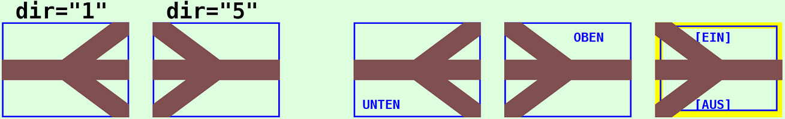
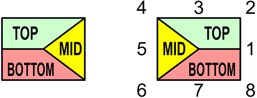

<table><tr><td></img></td><td>
Letzte &Auml;nderung: 22.1.2026 <a name="up"></a><br>   
<h1>Dreiweg-Weichensymbole  f&uuml;r RCC5V-GUIs</h1><h3>RCC5V_GUI_Demo_Turnout3Way</h3>
<a href="README.md">==> English version</a>&nbsp; &nbsp; &nbsp; 
</td></tr></table>   

# 1. Einleitung
Dieses Dokument beschreibt die Verwendung von Dreiweg-Weichensymbolen zur Erstellung eines Gleisstellbildes f&uuml;r RCC5V-GUI-Anwendungen.   
_Bild 1_ zeigt verschiedene Weichensymbole mit ihrer Bezeichnung. Die Symbole haben (noch) keine Verbindung zu einer realen Weiche, daher ist keine Schaltstellung eingezeichnet.   

   
_Bild 1: Dreiweg-Weichensymbole_   

## Inhaltsverzeichnis
1. [Einleitung](#x10)   
2. [Erforderliche Hardware und Software](#x20)
3. [Anzeige und Test der Symbole](#x30)   
4. [Gliederung der Software `RCC5V_GUI_Demo_Turnout3Way`](#x40)   
5. [Verwendung des `<RccTurnout3Way1>`-Tags](#x50)   
6. [Anmerkungen zur Programmierung](#x60)   

<a name="x20"></a>   

# 2. Erforderliche Hardware und Software
Zum Steuern der Weiche ist folgende Hardware erforderlich:   
* (Mindestens) eine Weiche mit Ansteuerung &uuml;ber einen RCC-Mikrocontroller und RCC-Block   
  _Empfehlung_: Verwendung der Dreiweg-Weiche im RCC-Blocktester, der auf [https://github.com/khartinger/RCC5V/tree/main/examples/blocktester](https://github.com/khartinger/RCC5V/tree/main/examples/blocktester) beschrieben wird (DCC-Adresse 31 und 32).   
* Ein laufender MQTT-Server (zB `mosquitto`), der &uuml;ber die IP `10.1.1.1` erreichbar ist.   
* Ein PC, Laptop oder Tablet, das mit dem MQTT-Server verbunden ist (zB &uuml;ber WLAN).   

Weiters wird zum Testen aller M&ouml;glichkeiten dieses Projektes folgende __Software__ ben&ouml;tigt:   
1. Visual Studio Code   
2. die Dateien aus diesem Verzeichnis (Projekt `RCC5V_GUI_Demo_Turnout3Way`)   
3. ein Browser   
4. ein installierter MQTT-Client   
  _Beispiel_: `mosquitto` mit `mosquitto_sub` und `mosquitto_pub`   
5. ein (oder zwei) Windows Eingabe-Fenster (cmd)   
6. `WinSCP` oder ein anderes FTP/SFTP-Client-Programm   

[Zum Seitenanfang](#up)   
<a name="x30"></a>   

# 3. Anzeige und Test der Symbole
Zum Anzeigen der Symbole in einem Browser-Fenster sind folgende Schritte erforderlich:   
1. Visual Studio Code (VSC) starten   
2. Projekt `RCC5V_GUI_Demo_Turnout3Way` laden   
3. Im VSC-Terminalfenster `npm run serve` eingeben   
4. Browser starten und folgende Adresse eingeben:   
`http://localhost:8080/#/`   

Es werden die Weichensymbole angezeigt, allerdings haben sie noch keine Funktionalit&auml;t, weil die Verbindung zum MQTT-Server fehlt.   

Damit die Weichensymbole funktionieren (d.h. MQTT Nachrichten senden und empfangen), sind weitere Schritte notwendig:   

5. Access-Point mit MQTT-Server starten.   
   Die IP-Adresse des MQTT-Servers sollte `10.1.1.1` sein   
6. PC oder Laptop mit dem WLAN des Access-Points verbinden.   
   (zB `Raspi11`, Passwort `12345678`)   
7. Die Hardware RCC-Blocktester einschalten und kontrollieren, ob sie sich mit dem MQTT-Server verbunden hat.   

Jetzt kann man im Browser kontrollieren, ob die Weichenstellung angezeigt wird.

_Bild 2_ zeigt die Weichen in Weichenstellung "Gerade".   

   
_Bild 2: Dreiweg-Weichensymbole in Weichenstellung "Gerade"_   

Ist auf dem PC/Laptop `mosquitto` installiert, so kann man in einem Terminal-Fenster (cmd) die MQTT-Daten&uuml;bertragung mitverfolgen. Dazu muss man zuerst ins mosquitto-Verzeichnis wechseln und den Subscriber starten:   
`cd C:/programme/mosquitto`   
`mosquitto_sub -h 10.1.1.1 -t rcc/# -v`   

Klickt man im Browser bei der ersten Weiche ins obere Feld, wird die Weiche im RCC-Blocktester auf "Links" gestellt und alle Weichensymbole wechseln auf Anzeige "Links" (weil in diesem Beispiel alle Weichen die gleiche Weichen-sid `sid="to1"` haben).   
Im Terminal-Fenster sieht man, dass folgende MQTT-Nachrichten gesendet wurden:   
```
rcc/demo1/set/31 0
rcc/demo1/ret/31 {"31":"0 received"}
rcc/demo1/ret/31 {"31":"-1"}
rcc/demo1/ret/32 {"32":"-1"}
rcc/demo1/ret/31 {"31":"0"}
rcc/demo1/ret/32 {"32":"1"}
```
Die erste Zeile ist der Schaltbefehl vom Browser und die zweite Zeile zeigt, dass der RCC-Blocktester die Nachricht erhalten hat. Die dritte und vierte Zeile ergibt sich aus dem undefinierten Zwischenzustand w&auml;hrend des Schaltens der Weiche (Wert `-1`) und die f&uuml;nfte und sechste Zeile zeigen, dass der Schaltvorgang erfolgreich ausgef&uuml;hrt wurde (`0` steht im Normalfall f&uuml;r Abzweig, `1` f&uuml;r Gerade).   

Klickt man auf die untere H&auml;lfte des Feldes, wird die Weiche auf "Rechts" geschaltet.   
Klickt man in den rechten Bereich beim geraden Gleis, wird die Weiche auf "Gerade" gestellt.   

[Zum Seitenanfang](#up)   
<a name="x40"></a>   

# 4. Gliederung der Software `RCC5V_GUI_Demo_Turnout3Way`   
  Das VSC-Projekt liegt im Ordner `RCC5V_GUI_Demo_Turnout3Way`. In diesem Verzeichnis befinden sich Dateien mit Informationen zum Projekt sowie die Unterverzeichnisse `.dist`, `images`, `node_modules` und `src`.   
Im Verzeichnis `src` befinden sich die eigentlichen Programmdateien:   
* Das Verzeichnis `classes` enth&auml;lt die Datei `Geo.ts`, in der viele Konstante und einfache Methoden definiert sind.   
* Das Verzeichnis `components` enth&auml;lt die Basis-Anzeigedatei `RccBase.vue` sowie die grafische Darstellung der Weichensymbole (`RccTurnout3Way1.vue`).
* Das Verzeichnis `controller` enth&auml;lt einen Basis-Controller `RccBaseController.ts` sowie den Weichen-Controller `RccTurnout3Way1Controller.ts`.   
* Das Verzeichnis `router` enth&auml;lt die Datei `index.ts`, die f&uuml;r das Weiterleiten der Links in der Kopfzeile (`MainView` und `About`) verantwortlich ist.   
* Das Verzeichnis `services` enth&auml;lt die beiden Dateien `RccMqttClient.ts` und `RccMqttClientInstance.ts`. Diese enthalten alle Funktionen, die f&uuml;r die MQTT-Kommunikation ben&ouml;tigt werden.   
  Jeder Controller, der MQTT-Nachrichten empfangen will, muss in der Datei `RccMqttClientInstance.ts` registriert werden.   
* Das Verzeichnis `views` enth&auml;lt die Dateien `About.vue` und `MainView.vue`.   
  In `MainView.vue` werden die einzelnen Weichen angeordnet (mit `<RccTurnout1>` Tags).   
* Die Datei `App.view` zeichnet die Gesamtansicht mit Kopfzeile und Grafik.   
* Die Datei `main.ts` startet schlie&szlig;lich die gesamte App.   

[Zum Seitenanfang](#up)   
<a name="x50"></a>   
<a name="x51"></a>   

# 5. Verwendung des `<RccTurnout3Way1>`-Tags
## 5.1 Syntax   
Weichensymbole werden in der Datei `MainView.vue` mit dem Tag `<RccTurnout3Way1 ...>` gezeichnet, wobei folgende Parameter erforderlich bzw. m&ouml;glich sind:   
* `x` (erforderlich): x-Koordinate des Mittelpunkts des Symbols in Pixel   
* `y` (erforderlich): y-Koordinate des Mittelpunkts des Symbols in Pixel   
* `dir` (erforderlich): Richtung des Weichensymbols (siehe [Kapitel 5.2](#x52))   
* `sid` (optional): ID des Symbols. Sie wird ben&ouml;tigt, damit die Weiche &uuml;ber MQTT kommunizieren kann oder mehrere Weichen gleichzeitig schalten k&ouml;nnen.   
* `border` (optional): Gibt an, ob ein Rahmen um ein Weichensymbol gezeichnet werden soll. (M&ouml;gliche Werte 0 bis 3, Default-Wert `'0'`)   
* `label` (optional): Gibt an, ob und welche Beschriftung f&uuml;r ein Weichensymbol angezeigt werden soll. (M&ouml;gliche Werte: "0" bis "3", Default-Wert `'0'`)   
* `color` (optional): Setzen der Farbe f&uuml;r f&uuml;r den Fahrweg. (Default-Wert: "-" bedeutet Standardwert `colorTurnoutClear` nehmen)    
* `header` (optional): Text in der Kopfzeile   
* `headeralign` (optional): Ausrichtung der Kopfzeile ("L" f&uuml;r links, "C" f&uuml;r Mitte, "R" f&uuml;r rechte Ausrichtung, Default-Wert: `'L'`)   
* `footer` (optional): Text in der Fu&szlig;zeile   
* `footeralign` (optional): Ausrichtung der Fu&szlig;zeile ("L" f&uuml;r links, "C" f&uuml;r Mitte, "R" f&uuml;r rechte Ausrichtung, Default-Wert: `'L'`)   

<a name="x52"></a>   

## 5.2 Richtung eines Weichensymbols
Da senkrechte Gleise nicht unterst&uuml;tzt werden, gibt es nur zwei m&ouml;gliche Richtungen f&uuml;r die Dreiweg-Weiche:   
* `dir="1"`: Weiche zeigt nach rechts   
* `dir="5"`: Weiche zeigt nach links   

<a name="x53"></a>   

## 5.3 MQTT-Funktionalit&auml;t
W&auml;hrend die Darstellung eines Dreiweg-Weichensymbols in der Datei `RccTurnout3Way1.vue` festgelegt ist, wird die Funktionalit&auml;t durch die Datei `RccTurnout3Way1Controller.ts` bestimmt.   
Die Eigenschaften einzelner Weichen werden im Array `to3ways` gespeichert. Ein Eintrag ist zB folgenderma&szlig;en aufgebaut:   
```ts
      {
        // ---test track 1--------------------------------------
        id: 't3w1',
        name: 'To3way1',
        iLState: -10,
        iRState: -10,
        sDCCL: '31',
        sDCCR: '32',
        subTopic: 'rcc/demo1/ret/31 rcc/demo1/ret/32 rcc/demo1/ret/status',
        pubTopic: 'rcc/demo1/set/31',
        pubTopicR: 'rcc/demo1/set/32',
      },
```
Bedeutung der einzelnen Parameter:   
* `id`: die ID stellt die Verbindung zum Anzeigeelement dar und muss mit dem Parameter `sid` &uuml;bereinstimmen.   
* `name`: Name der Weiche. Dieser wird derzeit nicht weiter verwendet.   
* `iLState`: Status der linken Weiche. Ein Wert -10 bedeutet "unbestimmt", 0 bedeutet "Abzweig" und 1 bedeutet "Gerade". Der Wert wird zB f&uuml;r die Anzeigefarbe des Symbols verwendet.   
* `iRState`: Status der rechten Weiche. Ein Wert -10 bedeutet "unbestimmt", 0 bedeutet "Abzweig" und 1 bedeutet "Gerade". Der Wert wird zB f&uuml;r die Anzeigefarbe des Symbols verwendet.   
* `sDCCL`: DCC-Adresse des linken Weiche als String (zB '31').   
* `sDCCR`: DCC-Adresse des rechten Weiche als String (zB '32').
* `subTopic`: Topics, auf die das Weichensymbol "h&ouml;rt". Dadurch kann z.B. der Schaltzustand der Weiche mit der richtigen Farbe dargestellt werden.   
   _Beispiel_: `'rcc/demo1/ret/31 rcc/demo1/ret/32 rcc/demo1/ret/status'`.   
  Mehrere Topics werden durch ein Leerzeichen getrennt.   
* `pubTopic`: Topic unter dem das linke Weichensymbol MQTT-Nachrichten sendet.   
   _Beispiel_: `'rcc/demo1/set/31'`   
* `pubTopicR`: Topic unter dem das rechte Weichensymbol MQTT-Nachrichten sendet.   
   _Beispiel_: `'rcc/demo1/set/32'`   

<a name="x54"></a>   

## 5.4 Vereinbarungen
### Positionsangabe
Die Angabe der Position des Mittelpunktes eines Symbols erfolgt in Pixel. Da Gleise auf einem Stellpult aneinandergereiht werden, muss man die Gr&ouml;&szlig;e der Symbole wissen. Diese ist in der Datei `classes/Geo.ts` festgelegt und wird folgenderma&szlig;en importiert:   
```ts
<script setup lang="ts">
import { Geof } from '../classes/Geo'
...
const geof = new Geof(0, 0, 1, 1)
const dx = computed(() => geof.dxo()) // x width of a symbol in pixel (80)
const dy = computed(() => geof.dyo()) // y heighth of a symbol in pixel (60)
```
Damit ergibt sich f&uuml;r die Positionierung ein Raster mit den Schrittweiten dx und dy. Die Position eines Symbols erfolgt somit &uuml;blicherweise folgenderma&szlig;en:   
`:x="1*dx"  :y="0*dy"`   
Der Punkt vor dem x bzw. y bedeutet, dass der Wert dynamisch (zu berechnen) ist.   

### sid
Die `sid` stellt die Verbindung zur Funktionalit&auml;t dar. Diese ist in der Datei `RccTurnout3Way1Controller.ts` definiert.   

### Rahmen
Die Angabe des Rahmens ist optional. Will man allerdings den Rahmen mehrerer Symbole gleich haben und gemeinsam &auml;ndern k&ouml;nnen, so definiert man im `<script>`-Bereich eine Variable daf&uuml;r:   
`const border = 1`   
Diese Variable verwendet man dann bei der `border`-Angabe:   
`:border="border"`   

<a name="x55"></a>   

## 5.5 Beispiele
1. An der Rasterposition 0/0: Weiche nach rechts (x+) mit Standardrahmen und ohne Beschriftung   
```html
<RccTurnout3Way1 :x="0*dx" :y="0*dy" sid="t3w1" dir="1" :border="border"></RccTurnout3Way1>
```   

2. An der Rasterposition 4/0: Weiche nach links mit Standardrahmen und Beschriftung "color red" rechts oben.   
```html
<RccTurnout3Way1 :x="4*dx"  :y="0*dy" sid="t3w1" dir="5" header="color red" headeralign="R" :border="border" color="red"></RccTurnout3Way1>
```   

[Zum Seitenanfang](#up)   
<a name="x60"></a>   
<a name="x61"></a>   

# 6. Anmerkungen zur Programmierung   
## 6.1 Zeichnen der Weichensymbole
### 6.1.1 Pfade für das Weichensymbol
Das Zeichnen der Weichensymbole erfolgt durch &Uuml;bereinanderzeichnen dreier Gleissymbole im `<template>` von `RccTurnout1.vue`:   
```html   
  <!--draw turnout parts (do not change lines!)------------- -->
  <path :d="drawTurnout1" :fill="colorTurnout2" :stroke="colorTurnout2" stroke-width="1" />
  <path :d="drawTurnout2" :fill="colorTurnout2" :stroke="colorTurnout2" stroke-width="1" />
  <path :d="drawTurnout3" :fill="colorTurnout1" :stroke="colorTurnout1" stroke-width="1" />
```   
Die Symbole 1 und 2, die zuerst stehen, zeigen die "inaktiven" Fahrtrichtungen an und die dritte Zeile die aktuelle Weichenstellung. Aus diesem Grund d&uuml;rfen die Zeilen auch __nicht vertauscht__ werden!   

In den Funktionen `drawTurnout1`, `drawTurnout2` und `drawTurnout3` wird das Zeichnen des Pfades einer Weiche mittels `pathTurnout(drawNr_)` aufgerufen und der String zurückgegeben.   

In der Funktion `pathTurnout(drawNr_)` wird zuerst kontrolliert, ob der Weichenstatus richtig ist (1=rechts, 2=links, 3=gerade) und ob die Weichenrichtung passt (1 oder 5).    
Danach wird die Reihenfolge der Gleisbilder festgelegt, abgängig davon, ob es die 1. 2. oder 3. Zeichnung ist. Dies ist wichtig, weil als dritte Zeichnung die aktive Richtung gezeichnet werden muss.   
Die Auswahl der Gleispfadnummer (25, 15, 58 oder 16, 15, 14) erfolgt mit Hilfe eines Arrays, dessen Index aus der Pfadnummer und dem Weichenstatus gebildet wird:   
`Index = Status + Pfad_Nummer - 2`   

| Status <br> Weiche | Pfad Nummer <br> (Zeichnen #) | Index | Weichenrichtung 1 <br> dir_=1 (nach rechts) | Weichenrichtung 5 <br> dir_=5 (nach links) |   
|:----------:|:-----:|:-----:|:--------------------:|:-----:|   
| 1 (rechts) |   1   |   0   | `--` 15 oder `_/` 25 | `--` 15 oder `/-` 16 |   
| 1 (rechts) |   2   |   1   | `--` 15 oder `_/` 25 | `--` 15 oder `/-` 16 |   
| 1 (rechts) | __3__ | __2__ |      __`-\` 58__     | __`\_` 14__ |   
| 2 (links)  |   1   |   1   | `--` 15 oder `-\` 58 | `--` 15 oder `\_` 14 |   
| 2 (links)  |   2   |   2   | `--` 15 oder `-\` 58 | `--` 15 oder `\_` 14 |   
| 2 (links)  | __3__ | __3__ |      __'_/' 25__     | __`/-` 16__ |   
| 3 (gerade) |   1   |   2   | `_/` 25 oder `-\` 58 | `/-` 16 oder `\_` 14 |   
| 3 (gerade) |   2   |   3   | `_/` 25 oder `-\` 58 | `/-` 16 oder `\_` 14 |   
| 3 (gerade) | __3__ | __4__ |      __'--' 15__     | __`--` 15__ |   

Man erkennt, dass das Array für `dir_=1` so aufgebaut sein muss: [x, x, 58, 25, 15], wobei die Reihenfolge der ersten beiden Werte x (die 25 und 15 sein müssen) egal ist. Wahl: 
```ts   
      // .....number of used path tracks........................
      let aTrack = Array(25, 15, 58, 25, 15)
      if (dir_ === 5) aTrack = Array(16, 15, 14, 16, 15)
```   

Mit der Pfadnummer wird schließlich durch Aufruf der Funktion `pathTrack(dir1)` der Zeichenstring erstellt.   

### 6.1.2 Farbe für das Weichensymbol
Für das Zeichnen der Fahrwege werden zwei Farben benötigt: eine für die beiden inaktiven Richtungen und eine für die echte Weichenrichtung. Die Zuordnung erfolgt in den beiden Funktionen `colorTurnout1` und `colorTurnout1`: 
```ts   
    // _______color 1 of the track (active path)________________
    colorTurnout1: function (): string {
      if (this.color.length > 1) return this.color
      if (this.iTo3way1State < 0) return this.geof.colorTrackUnknown
      return this.geof.colorTurnoutClear
    },
    // _______color 2 of the track (inactive path)______________
    colorTurnout2: function (): string {
      if (this.iTo3way1State < 0) return this.geof.colorTrackUnknown
      return this.geof.colorTurnoutBlocked
    },
```   

<a name="x62"></a>   

## 6.2 Klickbereiche f&uuml;r Weichensymbole
Beim Dreiweg-Weichensymbol gibt es drei Klickbereiche: "Top", "Mid" und "Bottom".   

   
_Bild 3: Klickbereiche beim Dreiweg-Weichensymbol_   

Bei einer Weiche nach    
* links (`dir="1"`)  bedeutet Top = Linksbogen, Mid = Gerade und Bottom = Rechtsbogen,
* rechts (`dir="5"`) bedeutet Top = Rechtsbogen, Mid = Gerade und Bottom = Linksbogen.

<a name="x63"></a>   

## 6.3 Senden der MQTT-Nachrichten
Das Senden von Nachrichten passiert in der `Klasse RccTurnout3Way1Controller`. Dort werden zwei Variablen `payloadTurnoutStright` und `payloadTurnoutCurved` definiert, die den "Normalzustand" abbilden.   
```ts
export class RccTurnout3Way1Controller extends RccBaseController {
  public payloadTurnoutStright = '1'
  public payloadTurnoutCurved = '0'
```

Beim Klicken in die obere Schaltfl&auml;che des Symbols wird die Funktion `onClkTop` von `RccTurnout3Wway1.vue` aufgerufen. In dieser werden die richtigen Topics (je nach Weichenrichtung) ausgew&auml;hlt, die Payload auf "Abzweig" gesetzt und die Nachricht(en) gesendet:   
```ts
    // _______on click: set turnout branch curve left/right_____
    onClkTop: function (): void {
      console.log(this.sid, 'Button-Click Top')
      // -----prepare send topics-------------------------------
      let aPubTopic = Array()
      if (this.to3way1?.pubTopic) {
        if(this.dir === '5') { // turnout 1 -< or 5 >-)
          aPubTopic = this.to3way1.pubTopicR.split(' ')
        } else {
          aPubTopic = this.to3way1.pubTopic.split(' ') 
        }
        // ---set payload to "curved"---------------------------
        const payload = rccTurnout3Way1Controller.payloadTurnoutCurved
        // ---publish message(s)--------------------------------
        aPubTopic.forEach(topic => {
          if (this.to3way1?.pubTopic) {
            rccTurnout3Way1Controller.publishRcc(topic, payload)
          }
        })
      }
    },
```

Das Senden erfolgt mit der Funktion `publishRcc`, die in der Datei `RccTurnout3Way1Controller.ts` steht:   
```ts
  // _________publish a mqtt message____________________________
  public publishRcc (topic: string, payload: string): void {
    // console.log('RccTurnout3Way1Controller:publishRcc:', '-t ' + topic + ' -m ' + payload)
    this.publish(topic, payload, false, 0).catch((e) => { console.error('RccTurnout3Way1Controller: ERROR:', e) })
  }
```

F&uuml;r die mittlere und untere Schaltfl&auml;che wird das gleiche in den Funktionen `onClkMid` bzw. `onClkBottom` gemacht.   

<a name="x64"></a>   

## 6.4 Empfang von MQTT-Nachrichten
Der Empfang von MQTT-Nachrichten erfolgt in der Datei `RccTurnout3Way1Controller.vue` in der Funktion `onMessage`. Dort wird die Statusnummer - abh&auml;ngig vom empfangenen Wert und der DCC-Adresse - festgelegt und in `iLState` und `iLState` gespeichert.   
```ts
  // _________receive a mqtt message____________________________
  public onMessage (message: Message): void {
    this.to3ways1.forEach(to3way1 => {
      const aSubTopic = to3way1.subTopic.split(' ')
      if (aSubTopic.includes(message.topic)) {
        // ---to3way1 topic found ---------------------------
        if (message.payload.length > 0) {
          // ------message received: split JSON-data------------
          try {
            const aPayload = JSON.parse(message.payload)
            let sDCC_ = to3way1.sDCCL
            let sState_ = aPayload[sDCC_]
            // ----calculate the state number-------------------
            if (sState_ === this.sState0) to3way1.iLState = 0
            if (sState_ === this.sState1) to3way1.iLState = 1
            sDCC_ = to3way1.sDCCR
            sState_ = aPayload[sDCC_]
            if (sState_ === this.sState0) to3way1.iRState = 0
            if (sState_ === this.sState1) to3way1.iRState = 1
          } catch (error) {
            to3way1.iLState = -9
            to3way1.iRState = -9
          }
        }
        // ---END: to3way1 topic found --------------------
      }
    })
  }
```

[Zum Seitenanfang](#up)