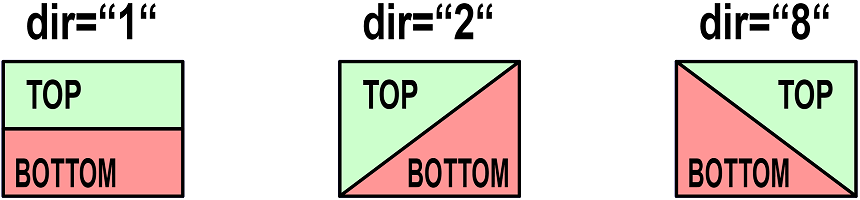

<table><tr><td></img></td><td>
Letzte &Auml;nderung: 23.1.2026 <a name="up"></a><br>   
<h1>Entkupplergleissymbole f&uuml;r RCC5V-GUIs</h1><h3>RCC5V_GUI_Demo_Uncoupler</h3>
<a href="README.md">==> English version</a>&nbsp; &nbsp; &nbsp; 
</td></tr></table>   

# 1. Einleitung
Dieses Dokument beschreibt die Verwendung von Entkupplersymbolen bei der Erstellung von Gleisstellbildern f&uuml;r RCC5V-GUI-Anwendungen.   
_Bild 1_ zeigt verschiedene Entkupplersymbole mit ihrer Bezeichnung. 
   
_Bild 1: Entkupplersymbole_   

## Inhaltsverzeichnis
1. [Einleitung](#x10)   
2. [Erforderliche Hardware und Software](#x20)
3. [Anzeige und Test der Symbole](#x30)   
4. [Gliederung der Software `RCC5V_GUI_Demo_Uncoupler`](#x40)   
5. [Verwendung des `<RccUncoupler1>`-Tags](#x50)   
6. [Anmerkungen zur Programmierung](#x60)   

<a name="x20"></a>   

# 2. Erforderliche Hardware und Software
Zum Aktivieren eines Entkupplers ist folgende Hardware erforderlich:   
* Ein Entkuppler mit Ansteuerung &uuml;ber einen RCC-Mikrocontroller und RCC-Block   
  _Empfehlung_: Verwendung des Entkupplers im RCC-Blocktester, der auf [https://github.com/khartinger/RCC5V/tree/main/examples/blocktester](https://github.com/khartinger/RCC5V/tree/main/examples/blocktester) beschrieben wird (DCC-Adresse 11).   
* Ein laufender MQTT-Server (zB `mosquitto`), der &uuml;ber die IP `10.1.1.1` erreichbar ist.   
* Ein PC, Laptop oder Tablet, das mit dem MQTT-Server verbunden ist (zB &uuml;ber WLAN).   

Weiters wird zum Testen aller M&ouml;glichkeiten dieses Projektes folgende __Software__ ben&ouml;tigt:   
1. Visual Studio Code   
2. die Dateien aus diesem Verzeichnis (Projekt `RCC5V_GUI_Demo_Uncoupler`)   
3. ein Browser   
4. ein installierter MQTT-Client   
  _Beispiel_: `mosquitto` mit `mosquitto_sub` und `mosquitto_pub`   
5. ein (oder zwei) Windows Eingabe-Fenster (cmd)   
6. `WinSCP` oder ein anderes FTP/SFTP-Client-Programm   

[Zum Seitenanfang](#up)   
<a name="x30"></a>   

# 3. Anzeige und Test der Symbole
Zum Anzeigen der Symbole in einem Browser-Fenster sind folgende Schritte erforderlich:   
1. Visual Studio Code (VSC) starten   
2. Projekt `RCC5V_GUI_Demo_Uncoupler` laden   
3. Im VSC-Terminalfenster `npm run serve` eingeben   
4. Browser starten und folgende Adresse eingeben:   
`http://localhost:8080/#/`   

Es werden die Entkupplersymbole angezeigt, allerdings haben sie noch keine Funktionalit&auml;t, weil die Verbindung zum MQTT-Server fehlt.   

Damit die Entkupplersymbole funktionieren (d.h. MQTT Nachrichten senden und empfangen), sind weitere Schritte notwendig:   

5. Access-Point mit MQTT-Server starten.   
   Die IP-Adresse des MQTT-Servers sollte `10.1.1.1` sein   
6. PC oder Laptop mit dem WLAN des Access-Points verbinden.   
   (zB `Raspi11`, Passwort `12345678`)   
7. Die Hardware RCC-Blocktester einschalten und kontrollieren, ob sie sich mit dem MQTT-Server verbunden hat.   

Jetzt kann man im Browser in die obere Hälfte eines Entkupplersymbols klicken und kontrollieren, ob der Entkuppler schaltet.

Ist auf dem PC/Laptop `mosquitto` installiert, so kann man in einem Terminal-Fenster (cmd) die MQTT-Daten&uuml;bertragung mitverfolgen. Dazu muss man zuerst ins mosquitto-Verzeichnis wechseln und den Subscriber starten:   
`cd C:/programme/mosquitto`   
`mosquitto_sub -h 10.1.1.1 -t rcc/# -v`   

Klickt man im Browser beim Entkupplersymbol in den oberen Bereich, wird der Entkuppler für einige Zeit (ca. 1,5 Sekunden) aktiviert und alle Entkupplersymbole wechseln auf Anzeige "Aktiv" (grün) (weil in diesem Beispiel alle Entkuppler die gleiche `sid="uc1"` haben).   
Im Terminal-Fenster sieht man, dass folgende MQTT-Nachrichten gesendet wurden:   
```
rcc/demo1/set/11 1
rcc/demo1/ret/11 {"11":"1 received"}
rcc/demo1/ret/11 {"11":"1"}
rcc/demo1/ret/11 {"11":"0"}
```
Die erste Zeile ist der Schaltbefehl vom Browser und die zweite Zeile zeigt, dass der RCC-Blocktester die Nachricht erhalten hat. Die dritte Zeile zeigt, dass der Entkuppler aktiv ist und die vierte Zeile zeigt, dass er sich wieder abgeschaltet hat (`0` steht für nicht aktiv).   

Klickt man in den unteren Bereich des Feldes, so wird der Entkupplungsvorgang sofort gestoppt.   

[Zum Seitenanfang](#up)   
<a name="x40"></a>   

# 4. Gliederung der Software `RCC5V_GUI_Demo_Uncoupler`   
  Das VSC-Projekt liegt im Ordner `RCC5V_GUI_Demo_Uncoupler`. In diesem Verzeichnis befinden sich Dateien mit Informationen zum Projekt sowie die Unterverzeichnisse `.dist`, `images`, `node_modules` und `src`.   
Im Verzeichnis `src` befinden sich die eigentlichen Programmdateien:   
* Das Verzeichnis `classes` enth&auml;lt die Datei `Geo.ts`, in der viele Konstante und einfache Methoden definiert sind.   
* Das Verzeichnis `components` enth&auml;lt die Basis-Anzeigedatei `RccBase.vue` sowie die grafische Darstellung der Entkupplersymbole (`RccUncoupler1.vue`).
* Das Verzeichnis `controller` enth&auml;lt einen Basis-Controller `RccBaseController.ts` sowie den Untkuppler-Controller `RccUncoupler1Controller.ts`.   
* Das Verzeichnis `router` enth&auml;lt die Datei `index.ts`, die f&uuml;r das Weiterleiten der Links in der Kopfzeile (`MainView` und `About`) verantwortlich ist.   
* Das Verzeichnis `services` enth&auml;lt die beiden Dateien `RccMqttClient.ts` und `RccMqttClientInstance.ts`. Diese enthalten alle Funktionen, die f&uuml;r die MQTT-Kommunikation ben&ouml;tigt werden.   
  Jeder Controller, der MQTT-Nachrichten empfangen will, muss in der Datei `RccMqttClientInstance.ts` registriert werden.   
* Das Verzeichnis `views` enth&auml;lt die Dateien `About.vue` und `MainView.vue`.   
  In `MainView.vue` werden die einzelnen Entkuppler angeordnet (mit `<RccUncoupler1>` Tags).   
* Die Datei `App.view` zeichnet die Gesamtansicht mit Kopfzeile und Grafik.   
* Die Datei `main.ts` startet schlie&szlig;lich die gesamte App.   

[Zum Seitenanfang](#up)   
<a name="x50"></a>   
<a name="x51"></a>   

# 5. Verwendung des `<<RccUncoupler1>`-Tags
## 5.1 Syntax   
Entkupplersymbole werden in der Datei `MainView.vue` mit dem Tag `<RccUncoupler1 ...>` gezeichnet, wobei folgende Parameter erforderlich bzw. m&ouml;glich sind:   
* `x` (erforderlich): x-Koordinate des Mittelpunkts des Symbols in Pixel   
* `y` (erforderlich): y-Koordinate des Mittelpunkts des Symbols in Pixel   
* `dir` (erforderlich): Richtung des Entkupplersymbols (siehe [Kapitel 5.2](#x52))   
* `sid` (optional): ID des Symbols, mit dem Entkuppler gruppiert und &uuml;ber MQTT angesprochen werden.   
* `border` (optional): Gibt an, ob ein Rahmen um ein Entkupplersymbol gezeichnet werden soll. (M&ouml;gliche Werte 0 bis 3, Default-Wert `'0'`)   
* `label` (optional): Gibt an, ob und welche Beschriftung f&uuml;r ein Entkupplersymbol angezeigt werden soll. (M&ouml;gliche Werte: "0" bis "3", Default-Wert `'0'`)   
* `color` (optional): Setzen der Farbe f&uuml;r den aktiven Zustand. (Default-Wert: "-" bedeutet Standardwert `this.geof.colorUncouplerOn` nehmen)    
* `header` (optional): Text in der Kopfzeile   
* `headeralign` (optional): Ausrichtung der Kopfzeile ("L" f&uuml;r links, "C" f&uuml;r Mitte, "R" f&uuml;r rechte Ausrichtung, Default-Wert: `'L'`)   
* `footer` (optional): Text in der Fu&szlig;zeile   
* `footeralign` (optional): Ausrichtung der Fu&szlig;zeile ("L" f&uuml;r links, "C" f&uuml;r Mitte, "R" f&uuml;r rechte Ausrichtung, Default-Wert: `'L'`)   

<a name="x52"></a>   

## 5.2 Richtung eines Entkupplersymbols
Da senkrechte Gleise nicht unterstützt werden, gibt es drei mögliche Richtungen für einen Entkuppler:   
* `dir="1"`: Entkuppler von links nach rechts (waagrecht)   
* `dir="2"`: Entkuppler von links unten nach rechts oben   
* `dir="8"`: Entkuppler von links oben nach rechts unten   

Statt der einstelligen Bezeichnungen können auch die Bezeichnungen für normale Gleise verwendet werden, d.h. statt "1" kann auch "15", statt "2" kann "26" und statt "8" kann "48" verwendet werden. Dies wird in der Funktion `iRir` (in `RccUncoupler1.vue`) angepasst.

<a name="x53"></a>   

## 5.3 MQTT-Funktionalit&auml;t
W&auml;hrend die Darstellung eines Entkupplersymbols in der Datei `RccUncoupler1.vue` festgelegt ist, wird die Funktionalit&auml;t durch die Datei `RccUncoupler1Controller` bestimmt.   
Die Eigenschaften einzelner Entkuppler werden im Array `uncouplers1` gespeichert. Ein Eintrag ist zB folgenderma&szlig;en aufgebaut:   
```
      {
        // ---test uncoupler 1----------------------------------
        id: 'uc1',
        name: 'Uncoupler1',
        iUncoupler1State: 0,
        sDCC: '11',
        subTopic: 'rcc/demo1/ret/11 rcc/demo1/ret/status',
        pubTopic: 'rcc/demo1/set/11',
      },
```
Bedeutung der einzelnen Parameter:   
* `id`: die ID stellt die Verbindung zum Anzeigeelement dar und muss mit dem Parameter `sid` &uuml;bereinstimmen.   
* `name`: Name des Entkupplers. Dieser wird derzeit nicht weiter verwendet.   
* `iUncoupler1State`: Status des Entkupplers. Ein Wert 0 bedeutet "Aus" und 1 bedeutet "Ein". Der Wert wird zB f&uuml;r die Anzeigefarbe des Symbols verwendet.   
* `sDCC`: DCC-Adresse des Entkupplers als String (zB '11').
* `subTopic`: Topics, auf die das Entkupplersymbol "h&ouml;rt". Dadurch kann z.B. der Schaltzustand des Entkupplers mit der richtigen Farbe dargestellt werden.   
   _Beispiel_: `'rcc/demo1/ret/11 rcc/demo1/ret/status'`.   
  Mehrere Topics werden durch ein Leerzeichen getrennt.   
* `pubTopic`: Topic unter dem das Entkupplersymbol MQTT-Nachrichten sendet.   
   _Beispiel_: `'rcc/demo1/set/11'`   

<a name="x54"></a>   

## 5.4 Vereinbarungen
### Positionsangabe
Die Angabe der Position des Mittelpunktes eines Symbols erfolgt in Pixel. Da Gleise auf einem Stellpult aneinandergereiht werden, muss man die Gr&ouml;&szlig;e der Symbole wissen. Diese ist in der Datei `classes/Geo.ts` festgelegt und wird folgenderma&szlig;en importiert:   
```
<script setup lang="ts">
import { Geof } from '../classes/Geo'
...
const geof = new Geof(0, 0, 1, 1)
const dx = computed(() => geof.dxo()) // x width of a symbol in pixel (80)
const dy = computed(() => geof.dyo()) // y heighth of a symbol in pixel (60)
```
Damit ergibt sich f&uuml;r die Positionierung ein Raster mit den Schrittweiten dx und dy. Die Position eines Symbols erfolgt somit &uuml;blicherweise folgenderma&szlig;en:   
`:x="1*dx"  :y="0*dy"`   
Der Punkt vor dem x bzw. y bedeutet, dass der Wert dynamisch (zu berechnen) ist.   

### sid
Die `sid` stellt die Verbindung zur Funktionalit&auml;t dar. Diese ist in der Datei `RccUncoupler1Controller.ts` definiert.   

### Rahmen
Die Angabe des Rahmens ist optional. Will man allerdings den Rahmen mehrerer Symbole gleich haben und gemeinsam &auml;ndern k&ouml;nnen, so definiert man im `<script>`-Bereich eine Variable daf&uuml;r:   
`const border = 1`   
Diese Variable verwendet man dann bei der `border`-Angabe:   
`:border="border"`   

<a name="x55"></a>   

## 5.5 Beispiele
1. An der Rasterposition 0/0: Entkuppler von links nach rechts mit Standardrahmen und ohne Beschriftung   
`<RccUncoupler1 :x="0*dx"  :y="0*dy" sid="uc1" dir="1" :border="border"></RccUncoupler1>`   

2. An der Rasterposition 1/0: Entkuppler von links unten nach rechts oben mit Standardrahmen und Beschriftung "HEADER" links oben   
`<RccUncoupler1 :x="1*dx"  :y="0*dy" sid="uc1" dir="2" header="HEADER" :border="border"></RccUncoupler1>
`   

[Zum Seitenanfang](#up)   
<a name="x60"></a>   
<a name="x61"></a>   

# 6. Anmerkungen zur Programmierung   
## 6.1 Klickbereiche f&uuml;r Entkupplersymbole
Der Klickbereich f&uuml;r Entkupplersymbole ist entweder ein Rechteck (`dir="1"` bzw. `dir="15"`) oder ein Dreieck (`dir="2"`, `dir="26"` bzw. `dir="8"`, `dir="48"`).   

   
_Bild 2: Klickbereiche beim Entkupplersymbol_   

Der Pfad für den Klickbereich wird in den Funktionen `pathTop` und `pathBottom` (in `RccUncoupler1.vue`) festgelegt. Als Beispiel die Codierung von `pathTop`:   
```
    // _______click area "top"__________________________________
    pathTop: function(): string {
      const dxo = this.geof.dxo()
      const dyo = this.geof.dyo()
      const dxo2 = this.geof.dxo2()
      const dyo2 = this.geof.dyo2()
      let s1 = ''
      switch (this.iDir)
      {
        case 15: 
          s1 += ' M' + this.x + ',' + this.y
          s1 += ' m' + (-dxo2) + ',' + (-dyo2)
          s1 += ' v' + dyo2
          s1 += ' h' + dxo
          s1 += ' v' + (-dyo2)
          s1 += ' z'
          break
        case 26:
          s1 += ' M' + this.x + ',' + this.y
          s1 += ' m' + dxo2 + ',' + (-dyo2)
          s1 += ' h' + (-dxo)
          s1 += ' v' + dyo
          s1 += ' z'
          break
        case 48:
          s1 += ' M' + this.x + ',' + this.y
          s1 += ' m' + (-dxo2) + ',' + (-dyo2)
          s1 += ' h' + dxo
          s1 += ' v' + dyo
          s1 += ' z'
          break
          default:
      }
      return s1
    },
```
Einige Hinweise dazu:   
* `' M' + this.x + ',' + this.y` setzt den Zeichenbeginn auf den Mittelpunkt des Symbols (in absoluten Koordinaten).   
* `const dxo = this.geof.dxo()` und `const dyo = this.geof.dyo()` definieren die Außenmaße des Symbols.   
* `dxo2` und `dyo2` sind die halben Außenmaße des Symbols.   
* `m` bedeutet relatives Bewegen des "Stiftes", `h` bedeutet horizontale Linie zeichnen (relativ vom aktuellen Punkt weg), `v` bedeutet vertikale Linie zeichnen (relativ) und 'z' bedeutet Schließen des Pfades.   

<a name="x62"></a>   

## 6.2 Senden der MQTT-Nachrichten
Das Senden von Nachrichten passiert in der `Klasse RccTurnoutController`. Dort werden zwei Variablen `payloadOn` und `payloadOff` definiert, die den "Normalzustand" abbilden.   
```
export class RccUncoupler1Controller extends RccBaseController {
  public payloadOn = '1'
  public payloadOff = '0'
```

Beim Klicken in die obere Schaltfl&auml;che des Symbols wird die Funktion `onClkTop` aufgerufen. In dieser wird die Payload auf `payloadOn` gesetzt und die Nachricht(en) gesendet:   
```
    // _______on click: turn uncoupler on_______________________
    onClkTop: function (): void {
      console.log(this.sid, 'Button-Click On')
      // -----is there a uncouPler?-----------------------------
      let payload = 'onClkOn: sid=' + this.sid
      const topicE = 'rcc/error'
      if (!this.uncoupler1) rccUncoupler1Controller.publishRcc(topicE, payload)
      // -----is there a topic for publishing?------------------
      if (this.uncoupler1?.pubTopic) {
        const aPubTopic = this.uncoupler1.pubTopic.split(' ')
        // ---prepare payload (1)-------------------------------
        payload = rccUncoupler1Controller.payloadOn
        // ---publish message(s)--------------------------------
        aPubTopic.forEach(topic => {
          if (this.uncoupler1?.pubTopic) {
            rccUncoupler1Controller.publishRcc(topic, payload)
          }
        })
      }
    },
```

Das Senden erfolgt mit der Funktion `publishRcc`, die in der Datei `RccUncoupler1Controller.ts` steht:   
```
  // _________publish a mqtt message____________________________
  public publishRcc (topic: string, payload: string): void {
    // console.log('RccUncoupler1Controller:publishRcc:', '-t ' + topic + ' -m ' + payload)
    this.publish(topic, payload, false, 0).catch((e) => { console.error('RccUncoupler1Controller: ERROR:', e) })
  }
```

F&uuml;r die untere Schaltfl&auml;che wird das gleiche in der Funktion `onClkBottom` gemacht.   

<a name="x63"></a>   

## 6.3 Empfang von MQTT-Nachrichten
Der Empfang von MQTT-Nachrichten erfolgt in der Datei `RccUncoupler1Controller.vue` in der Funktion `onMessage`. Dort wird die Statusnummer - abh&auml;ngig vom empfangenen Wert - festgelegt und in `iUncouplerState` gespeichert.   
```
  // _________receive a mqtt message____________________________
  public onMessage (message: Message): void {
    this.uncouplers1.forEach(uncoupler1 => {
      const aSubTopic = uncoupler1.subTopic.split(' ')
      if (aSubTopic.includes(message.topic)) {
        // ---uncoupler1 topic found ---------------------------
        if (message.payload.length > 0) {
          // ------message received: split JSON-data------------
          try {
            const aPayload = JSON.parse(message.payload)
            const sDCC_ = uncoupler1.sDCC
            const sState_ = aPayload[sDCC_]
            // ----calculate the state number-------------------
            if (sState_ === this.sState0) uncoupler1.iUncoupler1State = 0
            if (sState_ === this.sState1) uncoupler1.iUncoupler1State = 1
          } catch (error) {
            uncoupler1.iUncoupler1State = -99
          }
        }
        // ---END: uncoupler1 topic found --------------------------
      }
    })
  }
```


[Zum Seitenanfang](#up)
