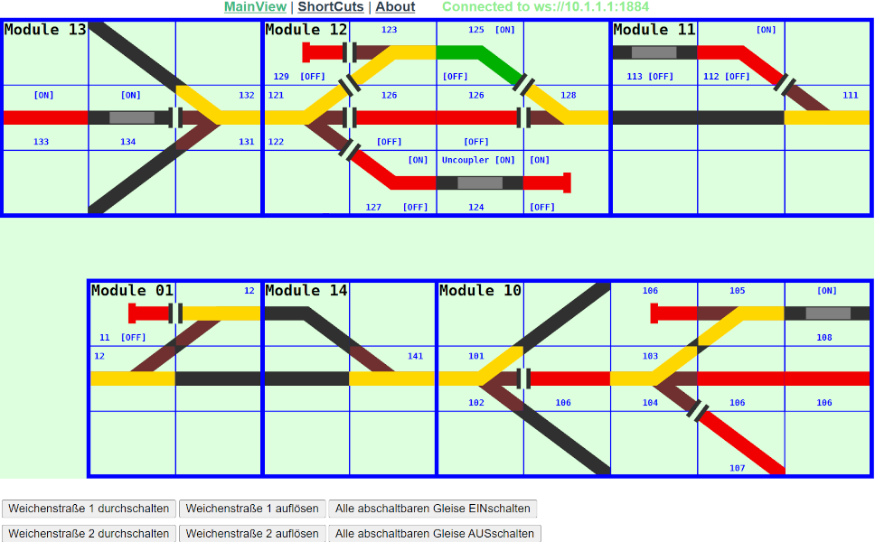

<table><tr><td></img></td><td>
Letzte &Auml;nderung: 18.1.2026     
<h1>RCC5V_GUI_Layout1: GUI zum Steuern mehrerer RCC5V-Modelleisenbahnmodule</h1>
<a href="README.md">==> English version</a>&nbsp; &nbsp; &nbsp; 
</td></tr></table>   

# 1. Einleitung
Um eine Vorstellung zu bekommen, worum es geht, zeigt das folgende Bild die grafische Oberfläche von GUI_Layout1:   

   
_Bild 1: GUI_Layout1_   

Mit Hilfe dieser Oberfläche ist es möglich, einzelne Weichen und Gleise zu schalten oder ganze Fahrstraßen einzurichten.   

Wie diese VUE-Anwendung erstellt wird in folgenden Kapiteln beschrieben.   
1. [die erforderliche Hardware](#x20)   
2. [Vu3-Tipps](#x30)   
3. [das grafische Zusammenfügen
 mehrerer RCC5V-Modelleisenbahn-Module zu 
einer Gesamtanlage](#x40)   
4. [das gemeinsame Ansteuern von 
RCC5V-Komponenten auf den Modulen](#x50)   
5. [das Erstellen von Fahrstraßen (routes) 
über mehrere Module hinweg.](#x60)   

Bildet man eine Release-Ausgabe von GUI-Layout1 und kopiert diese auf ein Raspberry Pi, so kann die Anlage zB mit einem Tablett oder Smartphone gesteuert werden. Wie man das macht wird im [Kapitel 3: Vue-Tipps](#x30) beschrieben.   

[Zum Seitenanfang](#up)   
   
   

# 2. Hardware
## 2.1 Eisenbahn-Module
Als Hardware werden für die Anlage 1 (layout1) folgende Module zusammengesteckt und verdrahtet (von West nach Ost):   
1. [Modul 13: Kehrschleife West](https://github.com/khartinger/RCC5V/blob/main/examples/module13/LIESMICH.md)   
2. [Modul 12: Ausweichstelle und Abstellgleis](https://github.com/khartinger/RCC5V/blob/main/examples/module12/LIESMICH.md)   
3. Modul 11: Tanklager   
4. [Modul 01: Gleis 1 auf 2 mit Güterschuppen](https://github.com/khartinger/RCC5V/blob/main/examples/module01/LIESMICH.md)   
5. [Modul 14: Zwei Gleise auf ein Gleis](https://github.com/khartinger/RCC5V/blob/main/examples/module14/LIESMICH.md)   
6. Modul 10: Kehrschleife Ost   

   

## 2.2 Verbindungshardware
Die Kommunikation mit den Modulen bzw. Komponenten erfolgt über WLAN und MQTT-Nachrichten, daher ist ein 
Access-Point erforderlich. Wie bereits in 
anderen Teilen des Projektes verwendet, kann 
der Access-Point z.B. ein Raspberry Pi mit 
folgenden Daten sein:   
* WLAN-Name: Raspi11   
* WLAN-Passwort: 12345678   
* IP-Adresse des MQTT-Servers: 10.1.1.1   

   

## 2.3 Hardware zur Steuerung der Komponenten
Die Steuerung der Komponenten kann mittels 
PC, Laptop oder Tablet erfolgen. Die Geräte müssen mit dem WLAN des Access-Points verbunden werden.   
Nach Starten des Browsers und Eingabe der Adresse   
`http://10.1.1.1/mqtt/layout1/#/`   
wird `GUI_Layout1` angezeigt.   

   

## 2.4 Programmierhardware
Zum Programmieren von `GUI_layout1` wird ein PC  oder Laptop mit folgender Software benötigt:   
1. Visual Studio Code   
2. Browser   
3. Windows Eingabe-Fenster (cmd)   
4. Putty (Client für den Fernzugriff mit SSH oder Telnet)   
5. WinSCP oder ein anderes FTP/SFTP-Client-Programm   

Im Eingabe-Fenster kann man die gesendeten MQTT-Nachrichten mitverfolgen:   
`mosquitto_sub -h 10.1.1.1 -t rcc/# -v`   

Öffnet man ein zweites Terminalfenster, so kann man in diesem MQTT-Befehle senden, z.B.   
`mosquitto_pub -h 10.1.1.1 -t rcc/module12/get -m status`   

[Zum Seitenanfang](#up)   
   

# 3. Vue3-Tipps
### VSC-Terminal-Fenster öffnen
Falls das Terminal-Fenster unten am Bildschirm nicht offen ist, kann es über das Menü `Terminal - Neues Terminal` geöffnet werden.   
### Internen Server starten
Wenn man den internen Server startet, kann man das erzeugte Bild sowie Änderungen life im Browser anschauen.   

Eingabe im VSC-Terminal, Reiter TERMINAL:   
`npm run serve`   
Eingabe im Browser:   
`http://localhost:8080/#/`   

### Erstellen einer fertigen Version
Eingabe im VSC-Terminal, Reiter TERMINAL:   
* Falls der interne Server läuft: Mit [Strg]C abbrechen, danach   
* `npm run build`   
Dadurch wird ein produktionsfähiger Build der Anwendung im Verzeichnis `./dist` des Projekts erstellt.   

Wenn man als Access-Point z.B. ein Raspberry PI verwendet, so sollte man auf diesem einen Apache-Server laufen lassen.   

Als Nächstes verbindet man sich mit dem Programm WinSCP mit dem Access-Point. Dazu muss man die IP-Adresse (10.1.1.1), den Benutzernamen und das Passwort des Benutzern wissen.   
Nachdem man mit dem RasPi verbunden ist, wechselt man im Remote-Fenster (meist rechts) ins Verzeichnis `/var/www/html`. Dort legt man ein Verzeichnis `mqtt` an, wechselt in dieses hinein und legt dort ein Verzeichnis `layout1` an.   
Im lokalen Fenster (links) wechselt man ins Projektverzeichnis und dort ins Verzeichnis `.dist`. Dann kopiert man den Inhalt des Verzeichnisses `./dist` (Ordner `assets` und `index.html`) ins Verzeichnis
`/var/www/html/mqtt/layout1`.

Ruft man im Brower die Adresse   
`http://10.1.1.1/mqtt/layout1/#/`   
auf, wird die `GUI_layout1` angezeigt.

[Zum Seitenanfang](#up)   
   

# 4. Grafisches Zusammenfügen mehrerer RCC5V-Modelleisenbahn-Module

# ..ToDo..

[Zum Seitenanfang](#up)